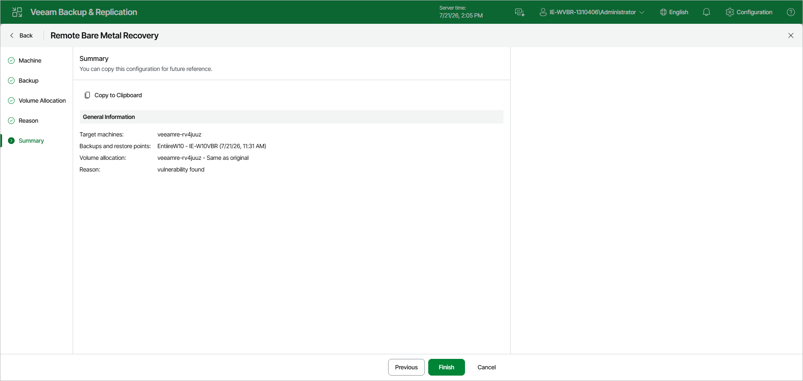

# Step 6. Complete Restore Process

At the Summary step of the wizard, review the settings of the remote bare metal recovery. To copy the configuration to the clipboard for future reference, click Copy to Clipboard. Click Finish to start the restore.

During the restore, Veeam Backup & Replication transfers backup data to the recovery appliance, restores volumes according to the configured allocation, and injects drivers into the restored operating system. The restore session is saved with the type Restore Recovery Appliance Volumes.

After the restore finishes, reboot the recovery appliance to boot the computer into the restored operating system. To do this, in the Veeam Backup & Replication web UI, navigate to Bare Metal Recovery, select the recovery appliance and click Reboot on the toolbar.

Page updated 2026-07-21

