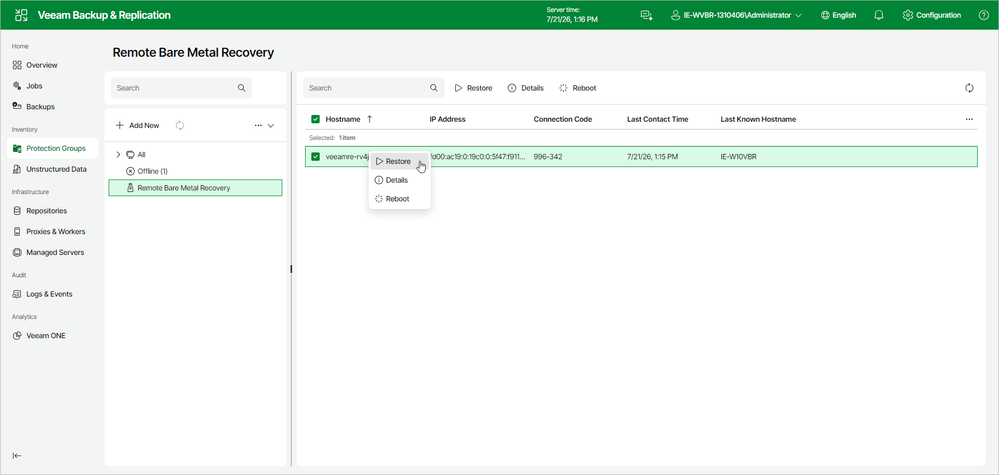

# Step 1. Launch Bare Metal Recovery Wizard

Before you launch the Bare Metal Recovery wizard, boot the target computer into the Veeam Recovery Environment. The recovery environment then connects to Veeam Backup & Replication and registers itself as a recovery appliance:

* If you prepared a Veeam Recovery Media ISO with remote bare metal recovery enabled, the user with physical access to the target computer boots it from a bootable device such as a CD/DVD or USB stick.
* If you enabled Virtual Recovery Partition for the protection group, select the protected computer in the Protection Groups view and click Bare Metal Recovery on the toolbar. Veeam Agent for Microsoft Windows changes the boot order and reboots the computer into Virtual Recovery Partition. Drivers for detected devices are installed automatically to reduce the risk of missing network drivers.

To launch the Bare Metal Recovery wizard:

1. In the management pane, click Protection Groups and select the Remote Bare Metal Recovery node.
2. In the list of recovery appliances, verify the connection code displayed for each appliance against the code shown on the target computer. This pairing check helps make sure that you are connected to the correct computer.
3. Select the check box next to one or more recovery appliances and click Restore on the toolbar.

Page updated 2026-07-21

