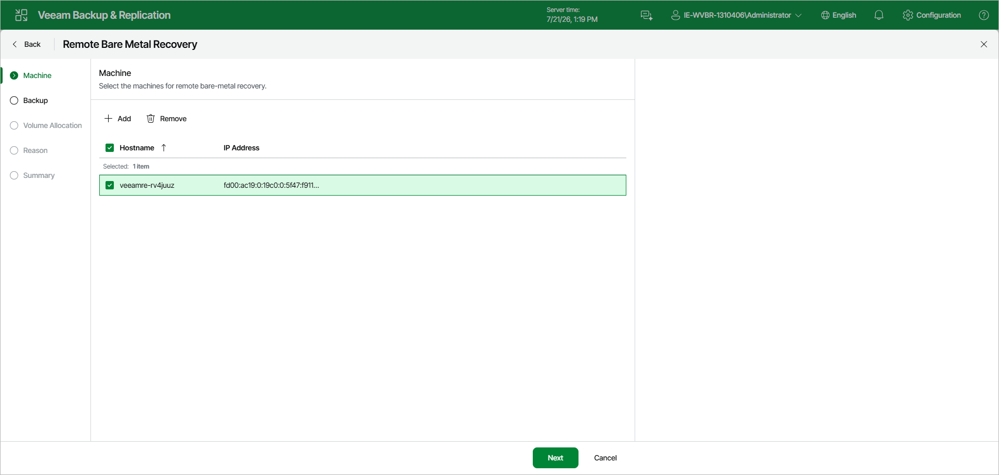

# Step 2. Select Machines

At the Machine step of the wizard, review the list of recovery appliances that will be restored. The wizard is pre-filled with the recovery appliances that you selected in the Remote Bare Metal Recovery node.

* To add another recovery appliance to the restore session, click Add.
* To exclude a recovery appliance from the restore session, select the check box next to the appliance and click Remove.

Page updated 2026-07-21

