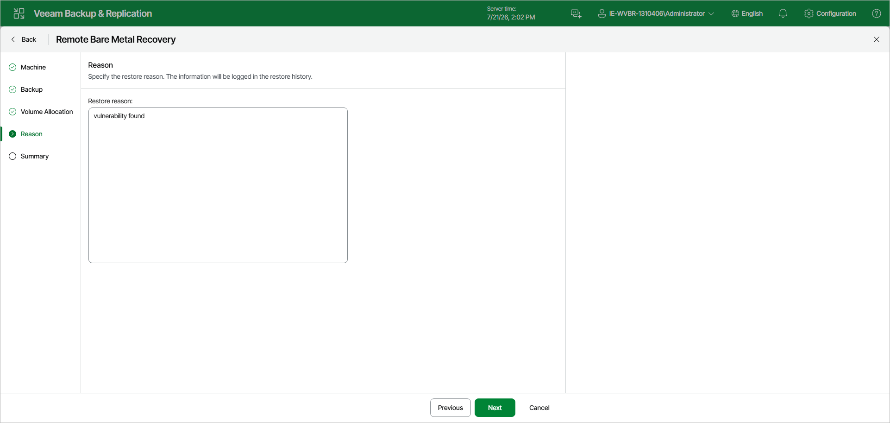

# Step 5. Specify Restore Reason

At the Reason step of the wizard, specify the reason for performing the remote bare metal recovery. This information will be saved in the session history so that you can reference it later.

Page updated 2026-07-21

