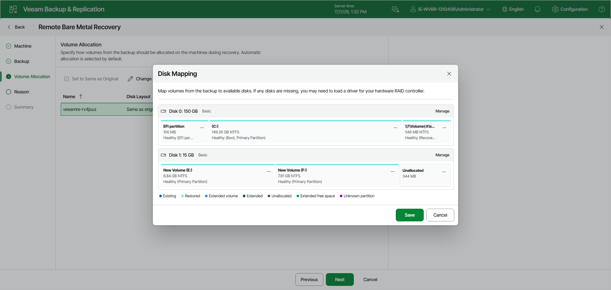

# Step 4. Specify Volume Allocation

At the Volume Allocation step of the wizard, specify how volumes from the backup should be allocated on the machines during recovery. Veeam Backup & Replication restores volumes with the same layout as in the backup by default — the Disk Layout column shows Same as original for each recovery appliance in the list.

To specify a different volume allocation for a recovery appliance:

1. In the list of recovery appliances, select the appliance and click Change Disk Mapping on the toolbar.
2. In the Volume Allocation window, select one of the following options and click Apply:

* Entire machine as in original backup — Veeam Backup & Replication restores the machine with the same volume allocation as in the backup. No further configuration is required.
* Custom allocation — you specify how volumes from the backup are allocated on the disks of the target machine.

1. If you have selected Custom allocation, in the Disk Mapping window, map volumes from the backup to available disks on the target machine.

* To modify the layout of a disk — extend or shrink volumes, remove volumes, change disks — click Manage next to the disk.
* Volume states are color-coded in the Disk Mapping window: Existing, Restored, Extended volume, Extended, Unallocated, Extended free space and Unknown partition.

1. Click Save.

After you save the mapping, the Disk Layout column shows Custom and the Volumes column displays the disks and volumes that will be restored.

To edit an existing custom mapping, select the recovery appliance in the list and click Customize on the toolbar. The Disk Mapping window opens with the current custom mapping.

To revert a customized mapping and restore volumes with the original layout, select the recovery appliance in the list and click Set to Same as Original on the toolbar.

|  |
| --- |
| NOTE |
| Manual volume allocation is not supported for dynamic volumes. |

Page updated 2026-07-21

