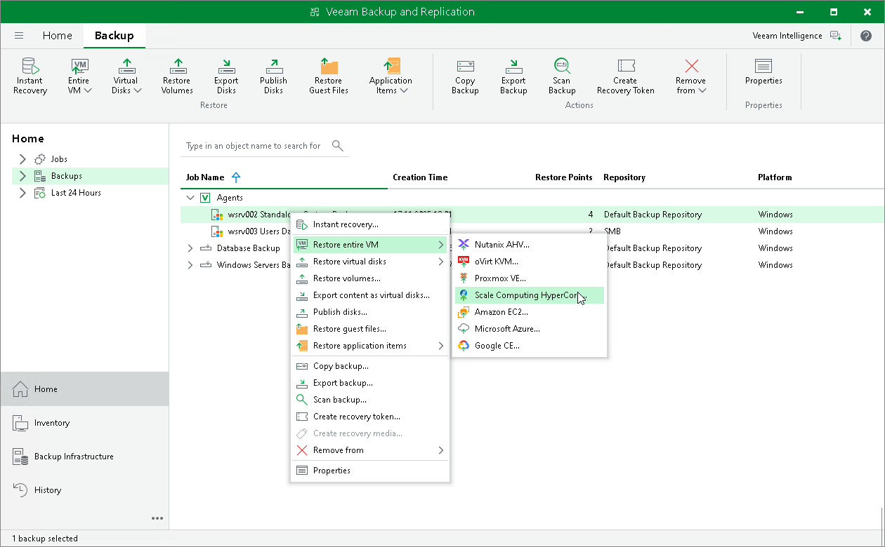

# Restoring Veeam Agent Backup to Scale Computing HyperCore

You can use the Veeam Backup & Replication console to restore a Veeam Agent computer as a Scale Computing HyperCore VM in your virtualization environment.

Restore to Scale Computing HyperCore

The procedure of restore to Scale Computing HyperCore for a Veeam Agent computer practically does not differ from the same procedure for a VM. To learn more about restore to Scale Computing HyperCore, see the [Performing VM Restore](https://helpcenter.veeam.com/docs/vpsch/userguide/restore_entire_vm.html?ver=2) section in the Veeam Plug-in for Scale Computing HyperCore User Guide.

