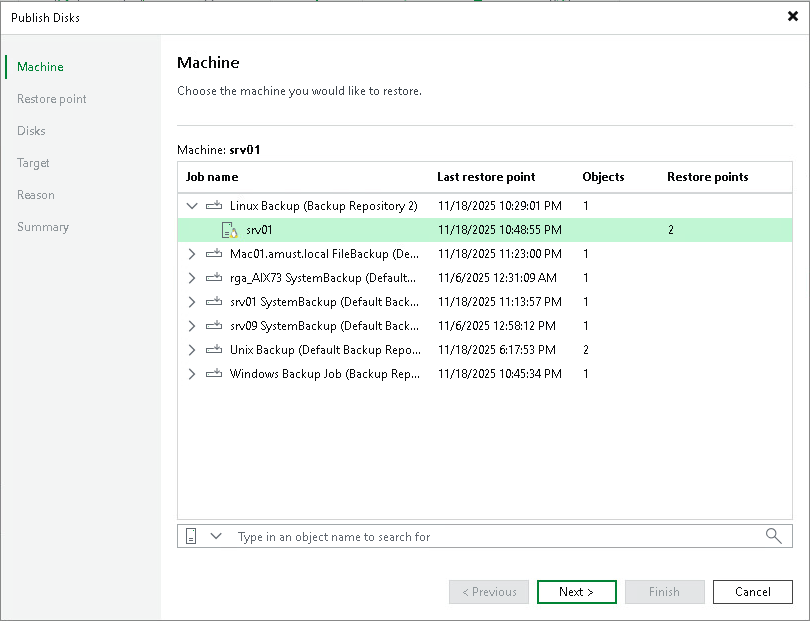

# Step 2. Select Computer

In this article

At the Machine step of the wizard, expand a backup and select a Veeam Agent computer whose disks you want to publish.

Page updated 11/17/2025

Page content applies to build 13.0.1.1071
