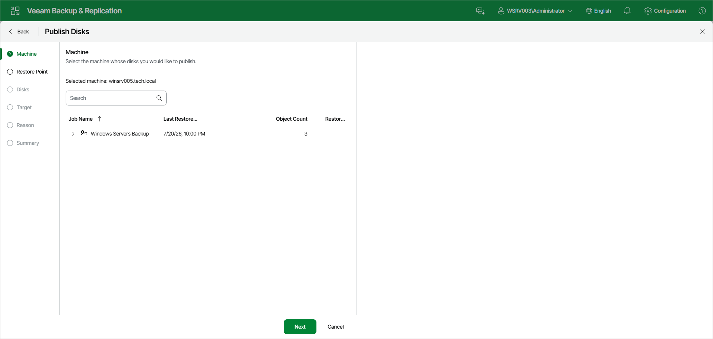

# Step 2. Select Computer

At the Machine step of the wizard, the Veeam Agent computer whose disks you want to publish is already selected.

|  |
| --- |
| TIP |
| To select a different computer, expand the backup and select the necessary computer. |

Page updated 2026-07-29

