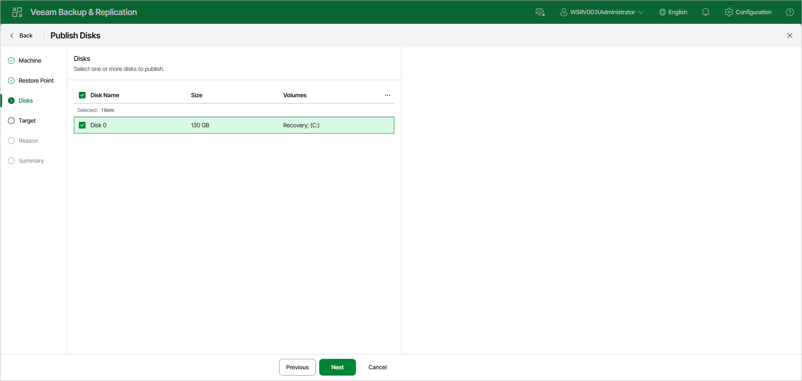

# Step 4. Select Disks

At the Disks step of the wizard, select the check box next to the disks that you want to publish. To select all disks from the backup, select the check box in the column header.

Page updated 2026-07-29

