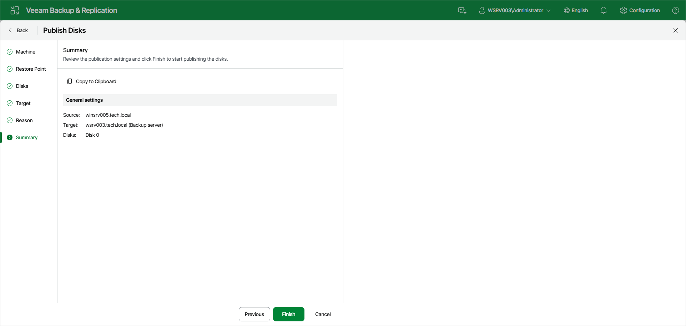

# Step 7. Finish Working with Wizard

At the Summary step of the wizard, review the publication settings and click Finish to start publishing the disks.

|  |
| --- |
| TIP |
| To copy the publication settings, click Copy to Clipboard. |

Page updated 2026-07-29

