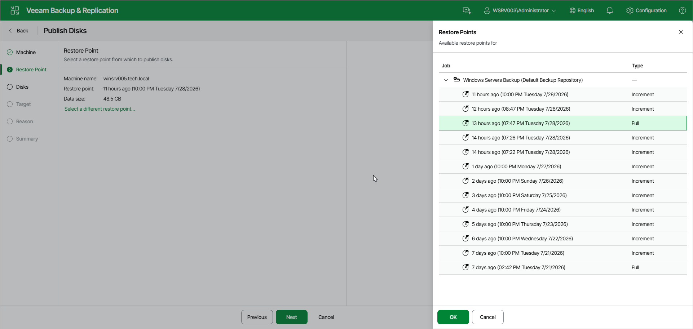

# Step 3. Select Restore Point

At the Restore Point step of the wizard, the most recent restore point from which you want to publish disks is already selected.

|  |
| --- |
| TIP |
| To select a different restore point, click Select a different restore point. In the Restore Points window, select the necessary restore point and click OK. |

Page updated 2026-07-29

