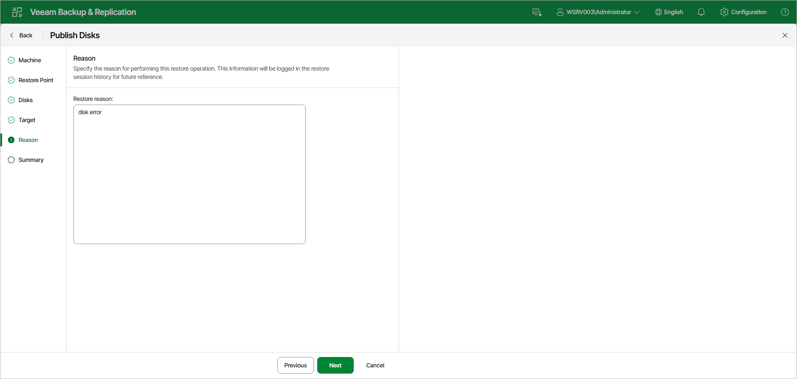

# Step 6. Specify Restore Reason

At the Reason step of the wizard, in the Restore reason field, specify a reason for publishing disks. This information will be logged in the restore session history for future reference.

Page updated 2026-07-29

