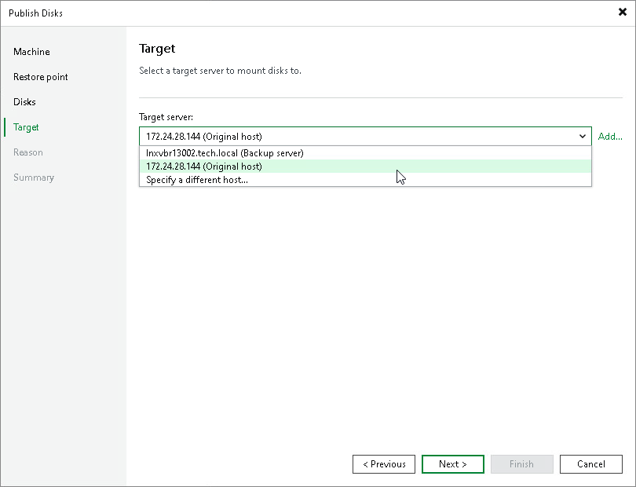
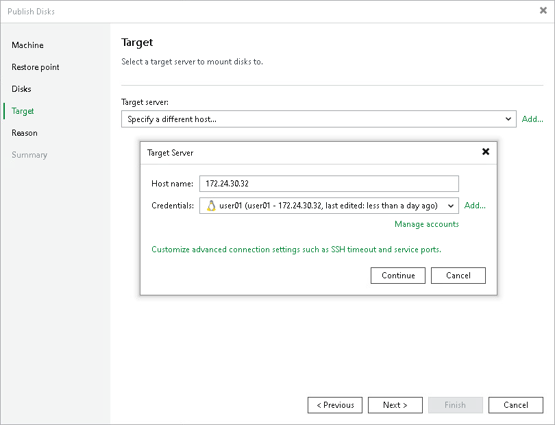
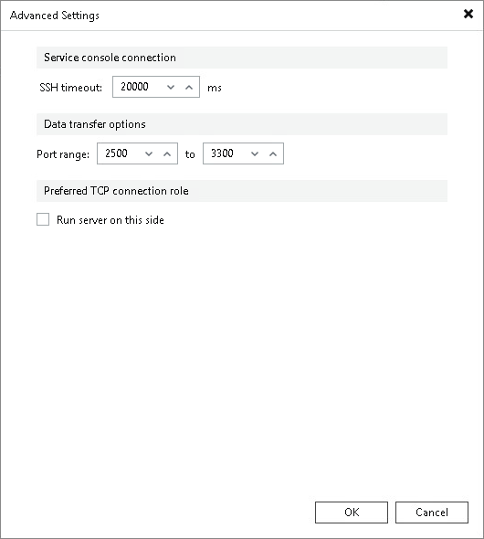

# Step 5. Select Target Server

At the Target step of the wizard, select a server that will have access to disk content. You can select the following servers depending on the OS of the Veeam Agent computer:

* Linux server — for Linux-based, Unix-based and macOS-based Veeam Agent computers.
* Microsoft Windows server — for Microsoft Windows-based Veeam Agent computers.

You can select one of the following types of servers:

* A server added to the backup infrastructure.

If you want to add a new backup server to the backup infrastructure at this step, click Add. In this case, you will be able to add a new Microsoft Windows server or a new Linux server. To learn more, see the [Adding Microsoft Windows Servers](https://helpcenter.veeam.com/docs/vbr/userguide/add_windows_server.html?ver=13) and  [Adding Linux Servers](add_linux_server.md).

* A temporary server. In this case, select Specify a different host from the drop-down list. In the Target Server window, specify the following settings:

1. In the Host name field, specify a server name or IP address of the server.
2. Select the account from the Credentials list. If you have not set up credentials beforehand, click the Manage accounts link or click Add on the right to add a new account in the Credentials Manager. To learn more, see [Credentials Manager](credentials_manager.md).
3. [For Linux-based, Unix-based and macOS-based Veeam Agent computers] Click Advanced and customize connection settings in the Network Settings window. To learn more, see [Customizing Connection Settings](#connection).

* [For Microsoft Windows-based and Linux-based Veeam Agent computers] The original server. In this case, select Original server from the drop-down list.

If prompted, specify credentials for the target server.

Customizing Connection Settings

If you specify a different host, you can customize connection settings for a target Linux server at the Target step of the Publish Disks wizard. To do so, click Customize advanced connection settings such as SSH timeout and service ports in the Target Server window and specify settings in the Advanced Settings window:

1. In the Service console connection section, specify an SSH timeout.
2. In the Data transfer options section, specify connection settings for file copy operations.
3. [For Linux server deployed outside NAT] In the Preferred TCP connection role section, select the Run server on this side check box.

To learn more about these settings, see [Specify Credentials and SSH Settings](linux_server_ssh.md).

  

