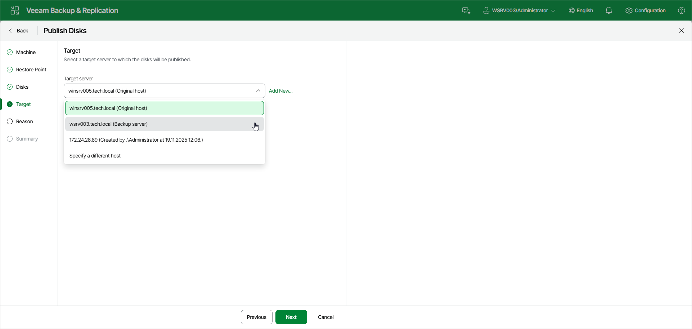

# Step 5. Select Target Server

At the Target step of the wizard, from the Target server drop-down list, select a server that will have access to the disk content. You can select the following servers depending on the OS of the Veeam Agent computer:

* Linux server — for Linux-based Veeam Agent computers.
* Microsoft Windows server — for Microsoft Windows-based Veeam Agent computers.

You can select one of the following types of servers:

* A server added to the backup infrastructure.

If you want to add a new server to the backup infrastructure at this step, click Add New. In this case, you will be able to add a new Microsoft Windows server or a new Linux server. To learn more, see [Adding Microsoft Windows Servers](add_windows_server.md) and [Adding Linux Servers](add_linux_server.md).

* A temporary server. In this case, from the Target server drop-down list, select Specify a different host. In the Target Server window, specify the following settings:

1. In the Host name field, specify a server name or IP address of the server.
2. Select the account from the Credentials list. If you have not set up credentials beforehand, click the Manage accounts link or click Add on the right to add a new account in the Credentials Manager. To learn more, see [Credentials Manager](credentials_manager.md).

If prompted, specify credentials for the target server.

Page updated 2026-07-29

