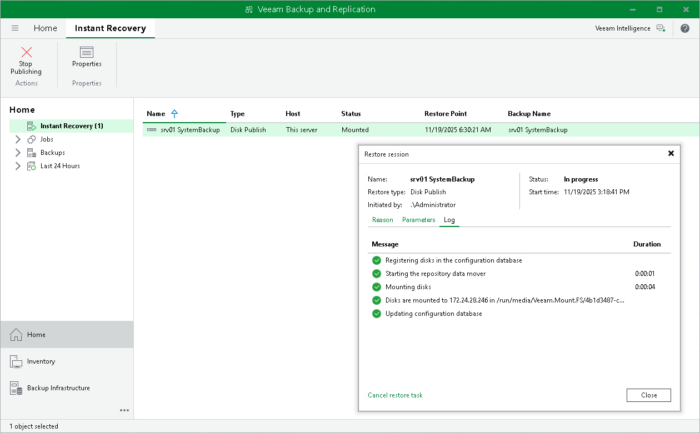
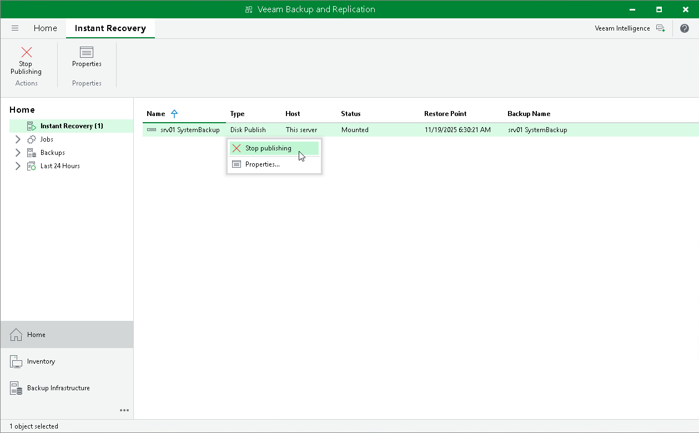
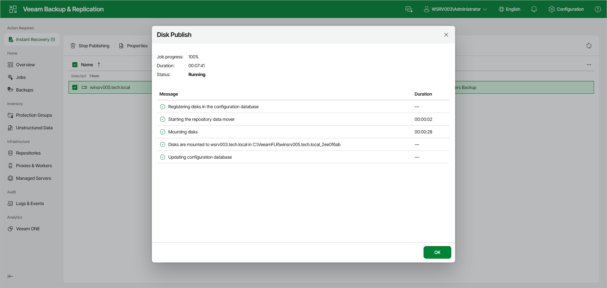
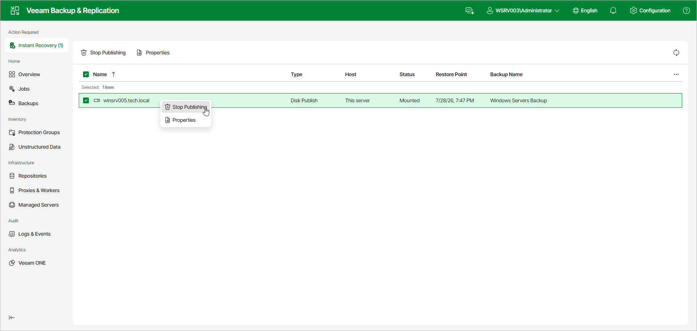

# Managing Publishing Disks Session

After you started a publishing session, you can check details about the session or stop it.

You can manage a publishing session in one of the following ways:

* [Using Veeam Backup & Replication Console](#console)
* [Using Veeam Backup & Replication Web UI](#webui)

Managing Publishing Disks Session Using Veeam Backup & Replication Console

Viewing Statistics on Publishing Session

To view publishing session statistics, do one of the following:

* Open the Home view. In the inventory pane, select Instant Recovery. In the working area, select the necessary publishing session and click Properties on the ribbon. Alternatively, right-click the session and Properties.
* Open the Home view. In the inventory pane select Last 24 hours. In the working area, double-click the necessary publishing session. Alternatively, you can select the session and click Statistics on the ribbon or right-click the session and select Statistics.
* Open the History view. In the inventory pane select Restore. In the working area, double-click the necessary publishing session. Alternatively, you can select the session and click Statistics on the ribbon or right-click the session and select Statistics.

The publishing statistics provides the following data:

* At the top of the Restore Session window, Veeam Backup & Replication shows general session statistics. It includes a name of the Veeam Agent computer whose disk you want to publish, a name of the backup server which initiated the publishing session, a user name of the account under which the session was started, session status and duration details.

* The Reason tab shows the reason for the publishing session.
* The Parameters tab shows information about the target server, the Veeam Agent computer whose disks you publish and the restore point selected for publishing.
* The Log tab shows the list of operations performed during the session.

Stopping Publishing Session

To stop a publishing session, do one of the following:

* Open the Home view. In the inventory pane select Instant Recovery. In the working area, double-click the necessary publishing session and click Cancel restore task in the Restore Session window. Alternatively, you can select the necessary publishing session and click Stop Publishing on the ribbon or right-click the session and click Stop Publishing.
* Open the Home view. In the inventory pane select Last 24 hours. In the working area, double-click the necessary publishing session and click Cancel restore task in the Restore Session window. Alternatively, you can select the necessary publishing session and click Stop on the ribbon or right-click the session and click Stop.
* Open the History view. In the inventory pane select Restore. In the working area, select the necessary publishing session and double-click it. In the Restore Session window, click Cancel restore task. Alternatively, you can right-click the publishing session and click Stop session.

Managing Publishing Disks Session Using Veeam Backup & Replication Web UI

Viewing Statistics on Publishing Session

When you click Finish in the Publish Disks wizard, the Disk Publish window opens automatically and shows the publishing session details: job progress, duration, status and a log of operations performed during the session.

If the Disk Publish window has been closed, do the following:

1. In the management pane, click Instant Recovery.
2. Select the check box next to the necessary publishing session and click Properties on the toolbar. Alternatively, right-click the session and select Properties.

Stopping Publishing Session

To stop a publishing session:

1. In the management pane, under Action Required, click Instant Recovery.
2. Select the check box next to the necessary publishing session and click Stop Publishing on the toolbar. Alternatively, right-click the session and select Stop Publishing.

Page updated 2026-07-29

