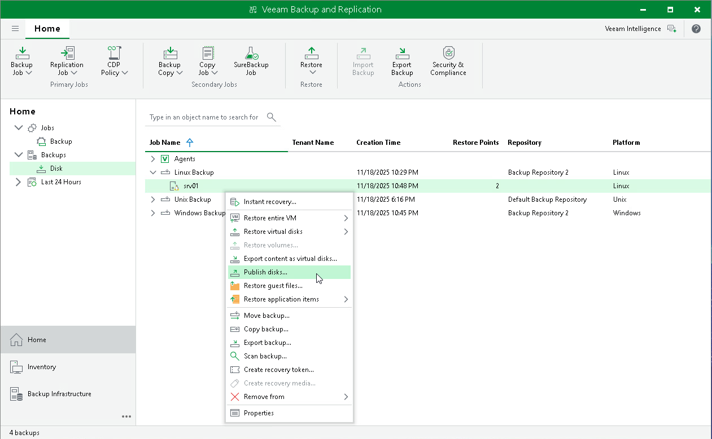

# Step 1. Launch Publish Disks Wizard

To launch the Publish Disks wizard, do either of the following:

* On the Home tab, click Restore > Agent > Disk Restore > Publish disk.

* Open the Home view. In the inventory pane, click Backups. In the working area, expand the necessary Veeam Agent backup, select a computer whose disks you want to publish and click Publish Disks on the ribbon. Alternatively, you can right-click the computer and select Publish disks. In this case, you will proceed to the [Restore point](integration_publish_point.md) step of the wizard.

