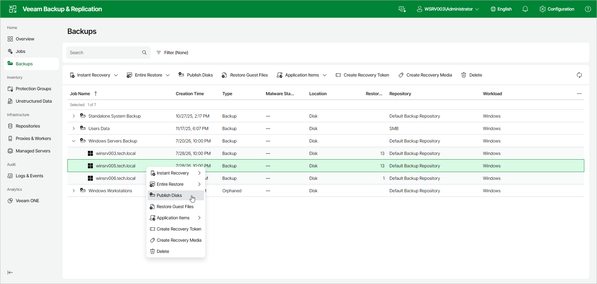

# Step 1. Launch Publish Disks Wizard

To launch the Publish Disks wizard, do the following:

1. In the management pane, click Backups.
2. Expand the necessary Veeam Agent backup and select the computer whose disks you want to publish.
3. Click Publish Disks on the toolbar. Alternatively, right-click the computer and select Publish Disks. In this case, you will proceed to the [Restore Point](integration_publish_point.md) step of the wizard.

Page updated 2026-07-29

