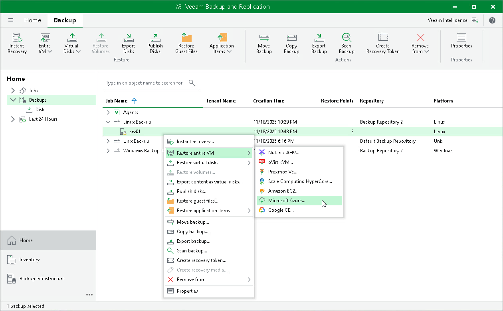

# Restoring to Microsoft Azure

You can use the Veeam Backup & Replication console to restore computers from Veeam Agent backups to Microsoft Azure.

Considerations and Limitations

If you restore a Veeam Agent computer to Microsoft Azure, consider the following:

* You can use backups of Microsoft Windows and Linux computers stored in a Veeam backup repository only. You cannot perform this operation with Veeam Agent backups stored in a Veeam Cloud Connect repository.

* Veeam Agent backups must be created at the entire computer level or volume level.

* If you recover an EFI-based system to Microsoft Azure, Veeam Agent will restore a BIOS-based Generation 1 VM.
* Veeam Backup & Replication offers experimental support for generation 2 VMs within restore to Microsoft Azure feature. To learn more, see [Generation 2 VM Support](https://helpcenter.veeam.com/docs/vbr/userguide/restore_azure.html?ver=13#generation-2-vm-support).

* [For backups of Linux computers] If the disk you want to restore contains a Logical Volume Manager (LVM) volume group, consider the following:

* Since LVM volume group is a logical entity that spans across the physical disks, Veeam Agent treats the original disk and the LVM volume group as separate entities. Therefore, Veeam Agent will restore the original disk and the LVM volume group as 2 separate disks. This way, all data, including the data within the LVM volume group, is accurately restored.
* Restoring the original disk and the LVM volume groups as 2 separate disks requires an increased amount of storage space. For example, you restore a machine with 2 disks, and a separate LVM volume group is configured on each of these disks. In this case, Veeam Agent will restore 4 disks. The restored disks will consume the storage space equal to the size of the 2 original disks and the 2 LVM volume groups from these disks.

|  |
| --- |
| TIP |
| After restore, you can remove unnecessary disks from the machine. To learn more, see [this Veeam KB article](https://www.veeam.com/kb4680). |

Restore to Microsoft Azure

The procedure of restore to Microsoft Azure from a Veeam Agent backup practically does not differ from the same procedure for a VM backup. To learn more about restore to Microsoft Azure, see [Restoring to Microsoft Azure](restore_azure_process.md).

