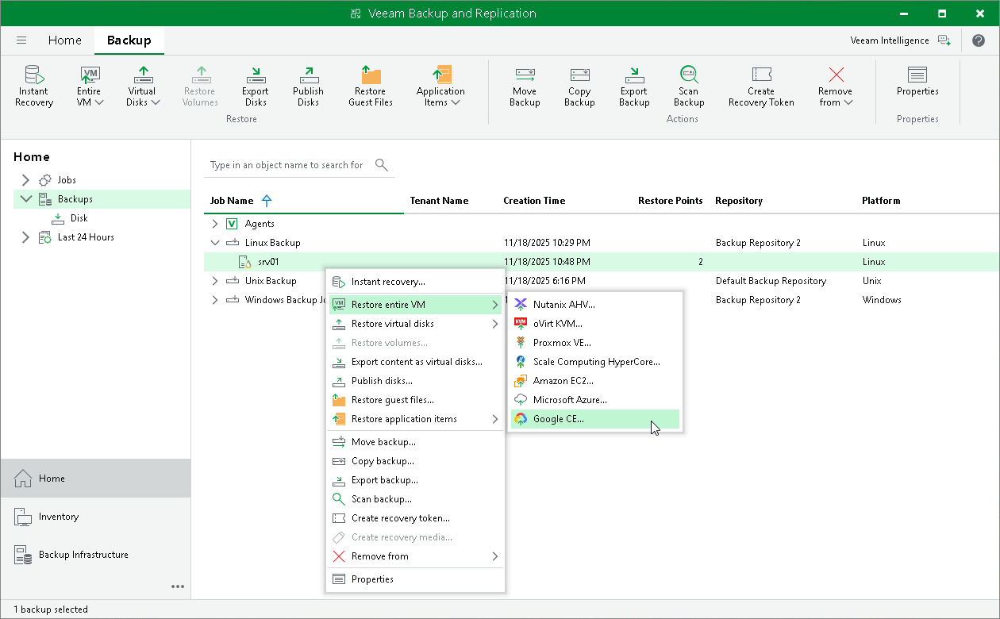

# Restoring to Google Compute Engine

You can use the Veeam Backup & Replication console to restore computers from Veeam Agent backups to Google Compute Engine.

Considerations and Limitations

If you restore a Veeam Agent computer to Google Compute Engine, consider the following:

* You can use backups of Microsoft Windows and Linux computers stored in a Veeam backup repository. You cannot perform this operation with Veeam Agent backups created on the Veeam Cloud Connect repository.
* Veeam Agent backups must be created at the entire computer level or volume level.

* [For backups of Linux computers] If the disk you want to restore contains a Logical Volume Manager (LVM) volume group, consider the following:

* Since LVM volume group is a logical entity that spans across the physical disks, Veeam Agent treats the original disk and the LVM volume group as separate entities. Therefore, Veeam Agent will restore the original disk and the LVM volume group as 2 separate disks. This way, all data, including the data within the LVM volume group, is accurately restored.
* Root file system partition and boot partition must not be on LVM logical volumes. For more information on this limitation, see [Google documentation](https://github.com/GoogleCloudPlatform/compute-image-import/blob/d16bdc692cf97228659352a43e3f5dd6c7cc5692/cli_tools/import_precheck/precheck/check_disks_linux.go#L34).
* Restoring the original disk and the LVM volume groups as 2 separate disks requires an increased amount of storage space. For example, you restore a machine with 2 disks, and a separate LVM volume group is configured on each of these disks. In this case, Veeam Agent will restore 4 disks. The restored disks will consume the storage space equal to the size of the 2 original disks and the 2 LVM volume groups from these disks.

|  |
| --- |
| TIP |
| After restore, you can remove unnecessary disks from the machine. To learn more, see [this Veeam KB article](https://www.veeam.com/kb4680). |

Restore to Google Compute Engine

The procedure of restore to Google Compute Engine from a Veeam Agent backup practically does not differ from the same procedure for a VM backup. To learn more about restore to Google Compute Engine, see [Restoring to Google Compute Engine](restore_google_process.md).

