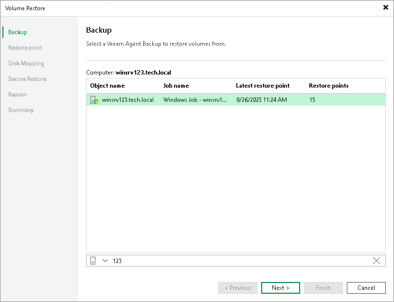

# Step 2. Select Backup

At the Backup step of the wizard, select a backup that contains volumes from which you want to recover data.

To quickly find the necessary backup, use the search field at the bottom of the window: enter a backup name or a part of it in the search field and click the Search icon or press [Enter].

Only Veeam Agent for Microsoft Windows backups are displayed.

