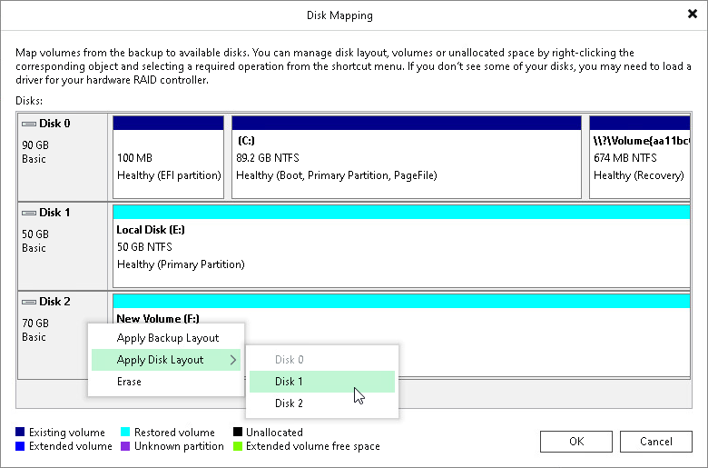
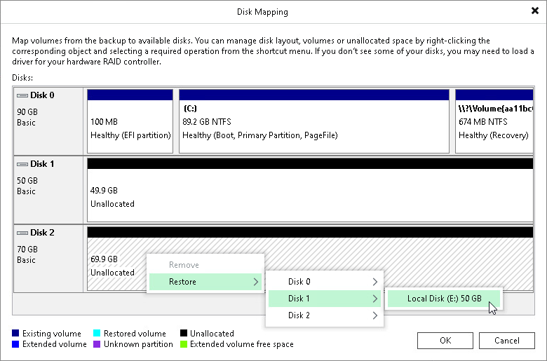
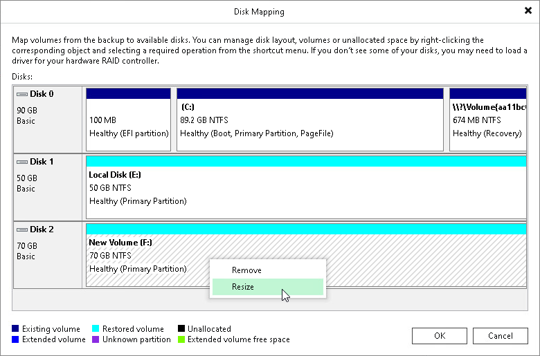

# Step 4. Map Restored Disks

At the Disk Mapping step of the wizard, select what volumes you want to restore and map volumes from the backup to volumes on the target computer.

|  |
| --- |
| IMPORTANT |
| It is strongly recommended that you change disk mapping settings only if you have experience in working with Microsoft Windows disks and partitions. If you make a mistake, your computer data may get corrupted. |

To select volumes for restore, do the following:

1. In the Destination host field, specify the target computer where you want to restore volumes. Click Choose and select the necessary computer. You can restore volumes only to computers that are added to the Veeam Backup & Replication inventory and run Veeam Agent for Microsoft Windows.
2. In the Disk mapping section, select the check boxes next to the volumes that you want to restore from the backup. By default, Veeam Backup & Replication restores volumes to their initial location and maps the restored volumes automatically. If the initial location is unavailable, a volume is restored to a disk of the same or larger size. If you want to map the restored volume to another computer disk, at the bottom of the wizard screen, click Customize disk mapping.

|  |
| --- |
| NOTE |
| If Veeam Backup & Replication cannot map a volume automatically, Veeam Backup & Replication will prompt you to perform disk mapping manually. To proceed to the Disk Mapping window, click Yes. |

1. In the Disk Mapping window, specify how volumes must be restored:

* Right-click the target disk on the left and select the necessary disk layout:

* Apply Backup Layout — select this option if you want to apply to disk the settings that were used on your computer at the moment when you performed backup.
* Apply Disk Layout — select this option if you want to apply to the current disk settings of another disk.
* Erase — select this option if you want to discard the current disk settings.

* Right-click unallocated disk space in the disk area on the right and select what volume from the backup you want to place on this computer disk.

If you want to change disk layout configured by Veeam Backup & Replication, right-click an automatically mapped volume and select Remove. You will be able to use the released space for mapping volumes in your own order.

1. [For restore with volume resize] You can resize a volume mapped by Veeam Backup & Replication to a target computer disk. To resize a volume, right-click it in the Disk Mapping window and select Resize. With this option selected, you will pass to the [Volume Resize](integration_volume_restore_resize.md) window.

|  |
| --- |
| NOTE |
| If you map a backup volume that is larger than the amount of available space on the target disk, Veeam Backup & Replication will prompt you to shrink the restored volume. After you agree and click OK, Veeam Backup & Replication will prepare to shrink the volume to the size of available disk space. |

