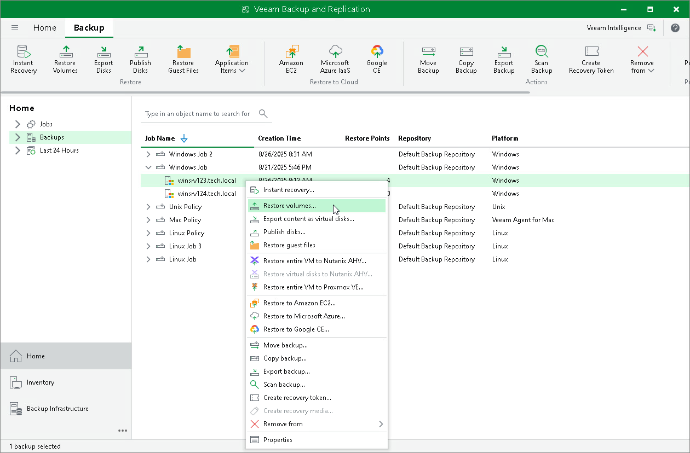

# Step 1. Launch Volume Level Restore Wizard

To launch the Volume Restore wizard, do either of the following:

* Open the Home tab and click Restore > Agent > Disk restore > Volume restore. In this case, you will be able to select a backup of the necessary Veeam Agent computer at the [Backup](integration_volume_restore_backup.md) step of the wizard.
* Open the Home view. In the inventory pane, click the Backups node. In the working area, expand the necessary Veeam Agent backup, select the necessary computer in the backup and click Restore Volumes on the ribbon or right-click the computer and select Restore volumes. In this case, you will proceed immediately to the [Restore Point](integration_volume_restore_point.md) step of the wizard.

