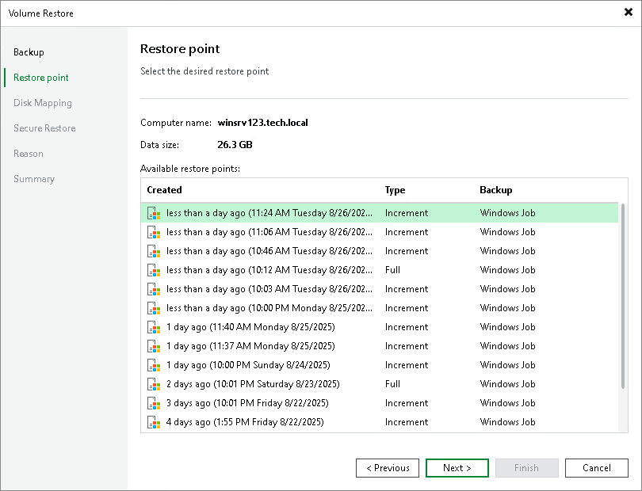

# Step 3. Select Restore Point

At the Restore Point step of the wizard, select a restore point from which you want to recover data.

By default, Veeam Backup & Replication uses the latest restore point. However, you can select any valid restore point to recover volumes to a specific point in time.

To select a restore point:

1. In the Available restore points section, select a restore point.
2. To restore volumes from backups created by pre-installed Veeam Agents, do the following:

1. In the Agent Credentials window, select the Veeam Agent computer whose volumes you want to restore and click Set.
2. In the Credentials window, specify credentials for the user account that has access to the protected computer. Veeam Backup & Replication will not store these credentials in its database.

