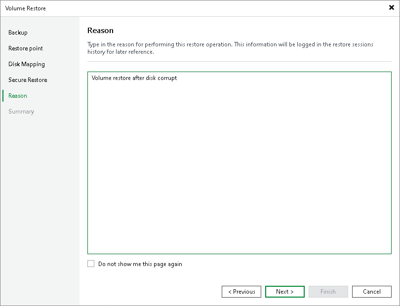

# Step 7. Specify Restore Reason

In this article

At the Reason step of the wizard, enter a reason for restoring the computer volume.

|  |
| --- |
| TIP |
| If you do not want to display the Reason step of the wizard in future, select the Do not show me this page again check box. |

Page updated 8/27/2025

Page content applies to build 13.0.1.1071
