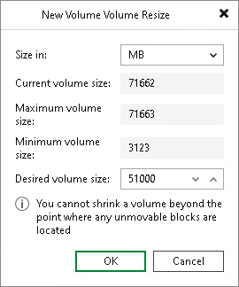

# Step 5. Resize Restored Volumes

At the Disk Mapping step of the wizard you can set the necessary size for the restored volumes. A volume will be shrunk or extended to the specified size during the process of data restore.

|  |
| --- |
| NOTE |
| By default, Veeam Agent for Microsoft Windows displays volume size in megabytes (MB). This allows you to specify the desired size for the volume precisely. You can also choose to display volume size in gigabytes (GB). This may be helpful when you need to resize volumes on larger computer disks and want to simplify disk size calculations.  When you use GB as a volume size unit, you can specify volume size with integral numbers, for example, 1 GB, 60 GB or 200 GB, but not 0,8 GB, 60,5 GB or 200,7 GB. However, if the maximum volume size is in fact greater than the displayed value for less than 1 GB, Veeam Agent for Microsoft Windows will automatically add the exceeding amount of disk space to the extended volume. For example, if the maximum volume size is 60,2 GB, Veeam Agent for Microsoft Windows will display this size as 60 GB. When you specify 60 GB as a desired volume size, Veeam Agent for Microsoft Windows will extend the volume to 60,2 GB. |

To resize a volume:

1. Specify a volume you want to resize:

1. Right-click a restored volume mapped to a target disk and select Resize.
2. [For volume shrink] Right-click unallocated disk space and select what volume from the backup you want to place on the computer disk. If the selected volume is larger than the amount of unallocated disk space, Veeam Backup & Replication will prompt you to shrink the restored volume.

1. In the volume resize window, select the volume size unit and specify the desired size for the restored volume.

