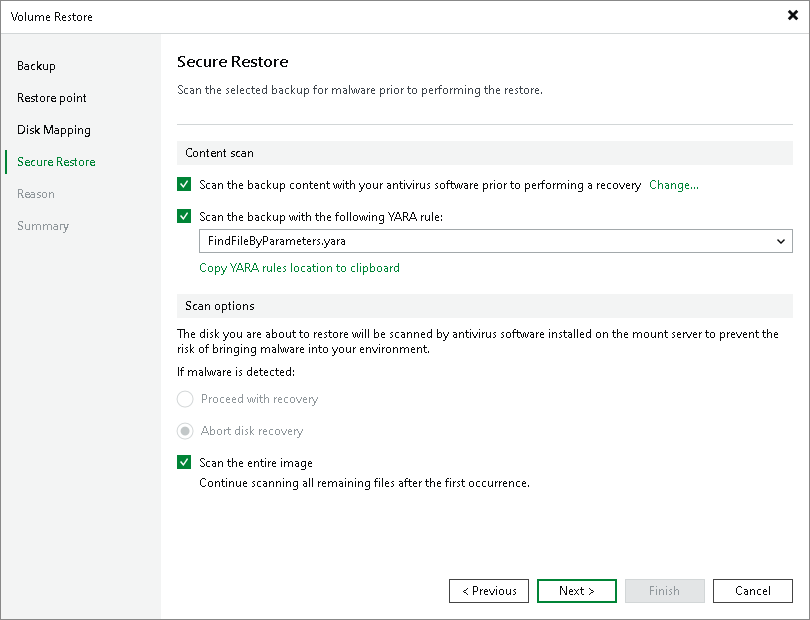

# Step 6. Specify Secure Restore Settings

At the Secure Restore step of the wizard, you can instruct Veeam Backup & Replication to perform secure restore. To learn more about secure restore, see [Secure Restore](av_scan_about.md).

To enable secure restore, select Scan the restored disk for malware prior to performing the recovery.

If you want to scan the entire backup file even if malware was already found, select Scan the entire image.

To specify secure restore settings:

1. In the Content scan section, specify the following:

1. If you want to scan the restored volume with a scan engine or antivirus software, select the method you want to use for data scan:

* Select the Scan restore points with Veeam Threat Hunter option to use Veeam Threat Hunter.

This option is available if you configured Veeam Threat Hunter as the detection engine in the malware detection settings. To learn more, see [Signature Detection](malware_detection_signature_detection.md).

* Select the Scan restore points with your antivirus software prior to performing a recovery option to use third-party antivirus software.

This option is available if you configured a third-party antivirus as the detection engine in the malware detection settings. To learn more, see [Signature Detection](malware_detection_signature_detection.md).

|  |
| --- |
| Tip |
| Click Change to open the Malware Detection Settings window where you can change the detection engine to Veeam Threat Hunter. |

1. If you want to scan the restored volume with a YARA rule, select the Scan backup content with the following YARA rule check box and select a YARA rule from the drop-down list. By default, the paths to the YARA rules are as follows:

* /var/lib/veeam/yara\_rules directory — if you use Veeam Backup & Replication on Linux.
* C:\Program Files\Veeam\Backup and Replication\Backup\YaraRules — if you use Veeam Backup & Replication on Microsoft Windows.

1. In the Scan options section, select the Continue scanning all remaining files after the first occurence check box if you want to continue volume scan after the first malware threat is found. For information on how to view results of the antivirus scan, see [Viewing Malware Scan Results](av_scan_log.md).

