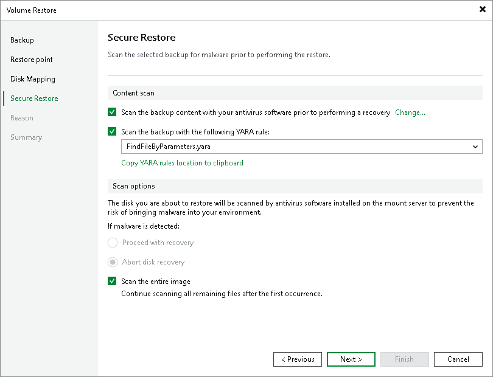

# Step 6. Specify Secure Restore Settings

At the Secure Restore step of the wizard, you can instruct Veeam Backup & Replication to perform secure restore — scan restored disk data with antivirus software before restoring the disk. To learn more about secure restore, see [Secure Restore](av_scan_about.md).

To specify secure restore settings:

1. In the Content scan section, specify the following:

1. To scan the restored volume with a scan engine or antivirus software, select the Scan the backup content with your antivirus software prior to performing a recovery check box. Veeam Backup & Replication will use the detection engine configured in the malware detection settings. To learn more, see [Signature Detection](malware_detection_signature_detection.md).

|  |
| --- |
| Tip |
| Click Change to open the Malware Detection Settings window where you can change the detection engine. |

1. To scan the restored volume with a YARA rule, select the Scan the backup with the following YARA rule check box and select a YARA rule from the drop-down list. To copy the path where YARA rules are stored, click Copy YARA rules location to clipboard.

1. In the Scan options section, select the Scan the entire image check box if you want Veeam Backup & Replication to continue scanning all remaining files after the first malware threat is found. Otherwise, the disk recovery will be aborted after the first threat is detected. For information on how to view results of the antivirus scan, see [Scanning Backups](malware_detection_scan_backup_console.md).

Page updated 2026-07-30

