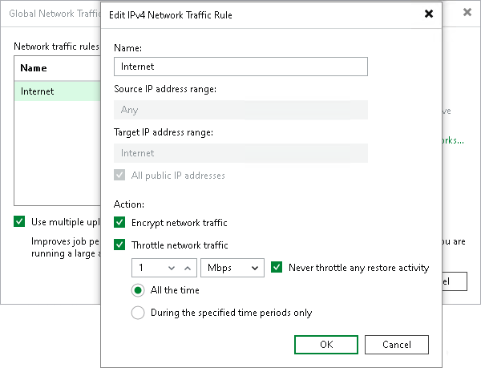

# Adjusting Internet Rule

In this article

The internet rule is a predefined network rule. This rule manages traffic transferred through public networks — all IPv4 networks whose IP ranges differ from 10.0.0.0/8, 172.16.0.0/12, 192.168.0.0/16 and all IPv6 networks whose IP ranges differ from fc00::/7. The internet rule also encrypts traffic for such networks. You cannot delete the internet rule — you can only adjust or turn it off.

|  |
| --- |
| Note |
| The internet rule does not apply to restores to cloud platforms (restore to Amazon EC2, restore to Microsoft Azure, and so on). |

Turning Off Rule

To turn off the internet rule, clear the Throttle network traffic to and Encrypt network traffic check boxes.

Adjusting Rule

To adjust the rule:

1. From the main menu, select Network Traffic Rules.
2. In the Global Network Traffic Rules window, select Internet from the list and click Edit.
3. In the Edit Network Traffic Rule window:

+ To disable encryption, clear the Encrypt network traffic check box.
+ To enable network traffic throttling, select the Throttle network traffic to check box. For details, see [Enabling Traffic Throttling](setting_network_traffic_throttling.md).

|  |
| --- |
| Tip |
| You can create custom network traffic rules targeted to public networks as described in section [Enabling Traffic Throttling](setting_network_traffic_throttling.md). |

Page updated 9/23/2025

Page content applies to build 13.0.1.1071
