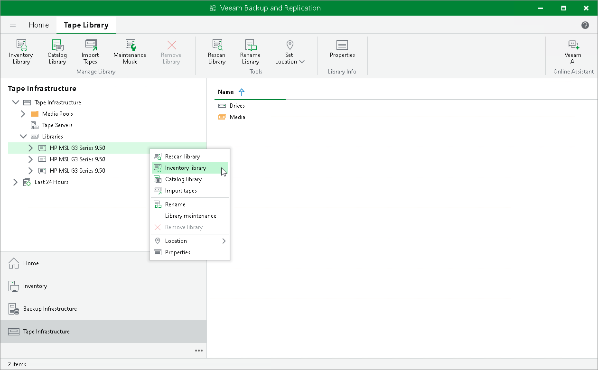
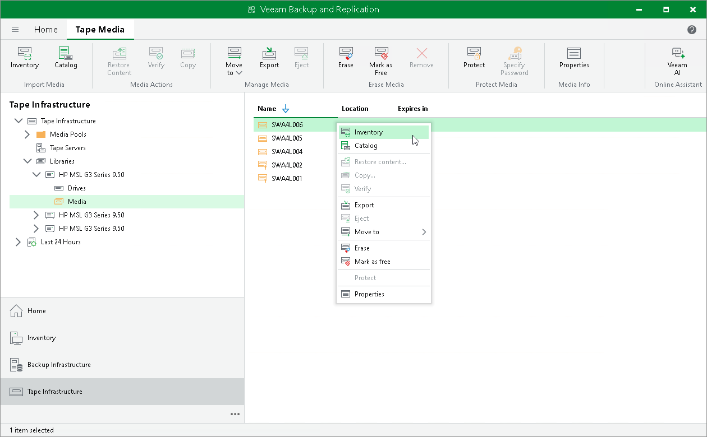
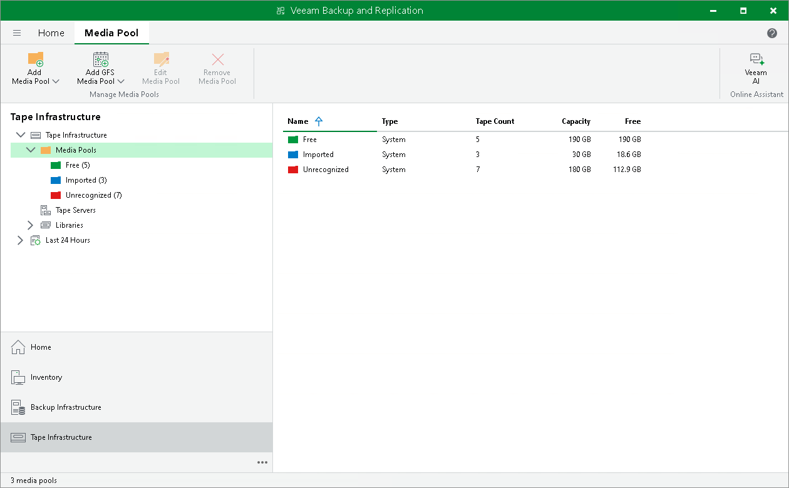

# Inventorying Tapes

When you load new tapes in your tape device for the first time, these tapes are presented to Veeam Backup & Replication as Unrecognized. To identify unrecognized tapes, you need to run tape inventory job against them.

Tape inventory job is a comparatively fast process of reading metadata written on tape with the aim of detecting name of the media set and the sequence number for the tape. Tape inventory jobs helps Veeam Backup & Replication identify empty tapes and detect non-empty tapes belonging to specific media set.

You can perform tape inventory for a whole [tape library](#library) or run the job against [selected tapes](#tapes) only.

Inventorying Tape Libraries

To inventory a whole tape library:

1. Open the Tape Infrastructure view.
2. Expand the Libraries node and select the library you want to inventory.
3. Click Inventory Library on the ribbon. Alternatively, you can right-click the tape library and select Inventory library from the drop-down menu. Veeam Backup & Replication will perform inventory for all online tapes in the library.

Inventorying Tapes

To inventory selected tapes:

1. Open the Tape Infrastructure view.
2. Navigate to the list of tapes either under the Media Pools or under the Libraries > LibraryName node > Media.
3. Select the necessary tapes in the list and click Inventory on the ribbon. Alternatively, you can right-click the selected tapes and choose Inventory.

The inventory log will display job session results. To access the inventory session details, you can open the History view and locate the necessary session under the Jobs > Tape node.

Inventory Results

After the inventory, Veeam Backup & Replication places tapes in predefined pools:

* Empty tapes are moved to the Free pool. You can use these tapes for archiving backups and files.
* Tapes that contain data written on another Veeam backup server remain in the Unrecognized pool. Veeam Backup & Replication displays the detected media set name and sequence number for these tapes. If you want to restore data from a specific media set, you need to run the tape catalog job for all tapes in this media set.

|  |
| --- |
| Note |
| Once the tape inventory job finishes, Veeam Backup & Replication ejects the tape to a library slot to prevent the tape from being accidentally overwritten. However, this does not apply to standalone tape drives. |

