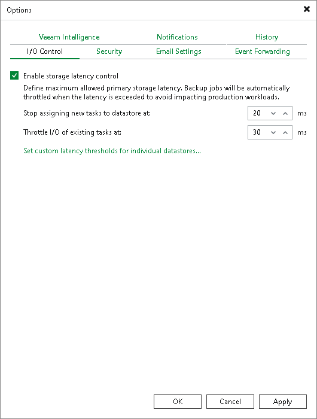
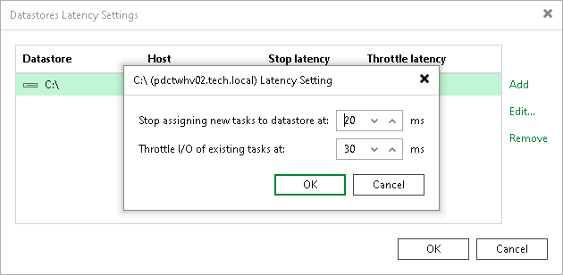

# Specifying I/O Settings

In this article

You can specify data processing settings.

Consider the following:

* The Enable storage latency control option is included in the Veeam Universal License. When using a legacy socket-based license, Enterprise or higher edition is required.
* The Set custom thresholds on individual datastores option is included in the Veeam Universal License. When using a legacy socket-based license, Enterprise Plus edition is required.
* For vVols/vSAN storage used in VMware vSphere environments, the Enable storage latency control option is not supported.

To specify data processing settings:

1. From the main menu, select Options.
2. Click the I/O Control tab.
3. To control the I/O load on the production storage where VMs reside, select the Enable storage latency control check box. When you enable storage latency control, Veeam Backup & Replication monitors storage read latency on production datastores and volumes during data protection and disaster recovery activities. To monitor the storage latency, Veeam Backup & Replication uses real-time metrics from the hypervisor where VMs reside. By default, metrics from the hypervisor are collected every 20 seconds on ESXi hosts and every 10 seconds on Microsoft Hyper-V hosts.

Specify two thresholds:

1. In the Stop assigning new tasks to datastore at field, specify the I/O latency limit at which Veeam Backup & Replication must not assign new tasks targeted at the datastore or volume.
2. In the Throttle I/O of existing tasks at field, specify the I/O latency limit at which Veeam Backup & Replication must decrease the speed of data retrieval of writing to or from the datastore or volume. When the I/O latency for this datastore or volume reaches this value, the Veeam Data Mover working with this datastore or volume will slow down data retrieval or writing.

The value in the Stop assigning new tasks to datastore at field cannot be greater than the value in the Throttle I/O of existing tasks at field.

|  |
| --- |
| Note |
| If you enable the storage latency control option, Veeam Backup & Replication starts processing VM disks residing on the same datastore with a 40-60 second time offset. This offset helps Veeam Backup & Replication evaluate the current I/O load on the datastore. For example, if you launch a job processing a VM with two disks, Veeam Backup & Replication will start processing the first VM disk, wait for 40-60 seconds to evaluate the I/O workload on the datastore, and then start processing the second VM disk.  Consider this behavior. If you schedule jobs that process multiple VM disks residing on the same datastore to start at the same time, the jobs performance will degrade. |

You can set the I/O latency limit for every storage in the virtual infrastructure separately.

To set the I/O latency limit for every storage separately:

1. From the main menu, select Options.
2. Click the I/O Control tab.
3. Click Set custom latency thresholds for individual datastores.
4. Click Add > Datastore or Add > Volume, select the necessary datastore or volume and click OK to add it to the storage list.
5. Select the added datastores or volumes in the list and click Edit.
6. Specify the I/O thresholds for the datastores or volumes.

Page updated 10/31/2025

Page content applies to build 13.0.1.1071
