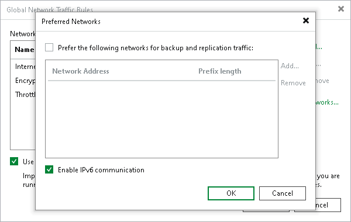

# IPv6 Support

Veeam Backup & Replication supports IPv6 communication for all backup infrastructure components. The following options are available:

* IPv4/IPv6 dual stack. This mode is enabled by default for new Veeam Backup & Replication installations.
* IPv4 only. For compatibility, this mode is used by default if you upgrade to Veeam Backup & Replication 12.

|  |
| --- |
| Note |
| Temporary IPv6 addresses are not supported for backup infrastructure components and backed-up machines. For more information about using temporary addresses, see [this RFC section](https://www.rfc-editor.org/rfc/rfc4941#section-3.6). |

To manage IPv6 communication, perform the following steps:

1. From the main menu, select Network Traffic Rules.
2. Click Networks.
3. To enable the IPv4/IPv6 dual stack mode, select the Enable IPv6 communication check box. To enable the IPv4 only mode, clear the check box.

After you enable IPv6 communication, you can add backup infrastructure components with IPv6 addresses to the Veeam Backup & Replication console and configure IPv6 networks and traffic rules. You can use any text representation format of the IPv6 address, although RFC 5952 describes the canonical format as recommended. For more information, see [this RFC section](https://www.rfc-editor.org/rfc/rfc5952#section-4).

Note that if you want to switch back to the IPv4 only mode, you must remove backup infrastructure components added only with IPv6 addresses from the Veeam Backup & Replication console.

|  |
| --- |
| Note |
| If you use the IPv4/IPv6 dual stack mode and there are backup infrastructure components added to the Veeam Backup & Replication console using FQDN, Microsoft Windows itself determines which source address and the network protocol (IPv4 or IPv6) will be used for connection between Veeam Backup & Replication and these components. For more information, see [this Microsoft article](https://learn.microsoft.com/en-US/troubleshoot/windows-server/networking/configure-ipv6-in-windows).  This case is also applied to your backup infrastructure if you use Kerberos authentication. For more information, see [Kerberos Authentication](kerberos_authentication.md). |

