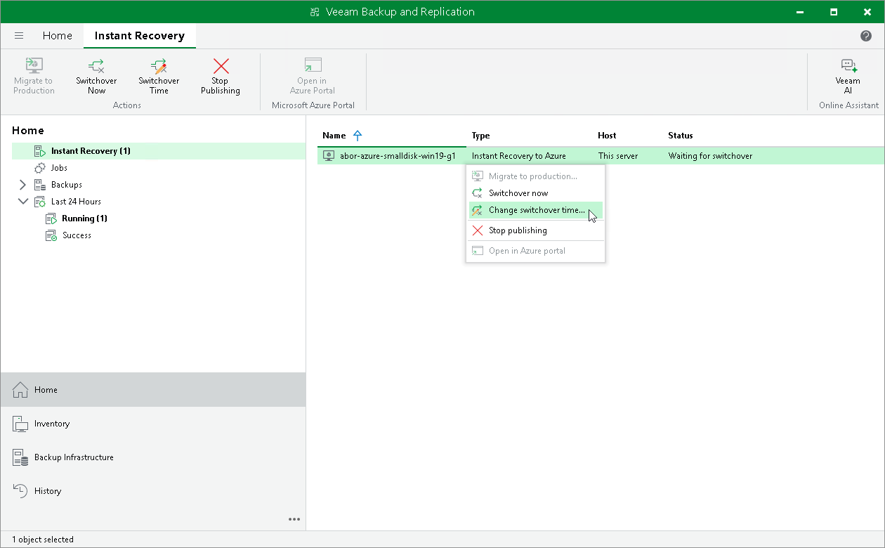

# Changing Switchover Time

The following instructions apply if you have selected to start the switchover manually or at the scheduled time in the [Migrate to production](ir_azure_finalize.md#migrate) wizard.

To change the time when Veeam Backup & Replication will perform the switchover:

1. Open the Home view.
2. In the inventory pane, navigate to the Instant Recovery node.
3. Right-click the VM for which you want to change the schedule and select Change switchover time.

