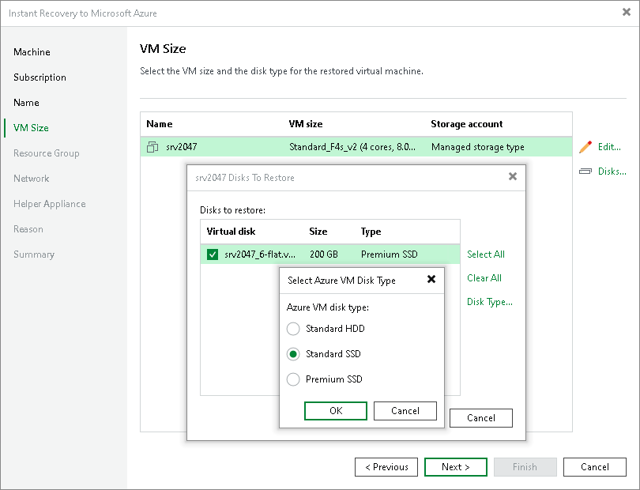

# Step 5. Specify VM Sizes and Disks

In this article

At the VM Size step of the wizard, you can select VM sizes. By default, Veeam Backup & Replication selects the smallest size that can support the number of disks for the recovered VM and recovers all workload disks.

Selecting VM Size

To select a size:

1. In the list, select a workload and click Edit.
2. From the Size list, select a size for the recovered VM.

Make sure that you select the right VM size that corresponds to the initial workload configuration. The size affects the number of CPU cores, memory and disk resources that will be allocated to the recovered workload. For more information, see [Microsoft Docs](https://docs.microsoft.com/en-us/azure/virtual-machines/sizes).

|  |
| --- |
| Note |
| Microsoft Azure subscriptions have default limits on the number of CPU cores. Make sure that the recovered workload size that you select does not exceed limits of the subscription. |

Selecting Disks to Restore and Changing Their Types

You can recover all disks or specific disks of a workload. You can also change the disk types of the recovered disks if you have selected the managed storage type.

To select specific disks and change their type, do the following:

1. In the list, select a workload and click Disks.
2. In the Disks to restore window, check that check boxes next to disks that you want to recover are selected. Clear check boxes next to disks that you do not want to recover.
3. Select a disk and click Disk Type. In the Select Azure VM Disk Type window, select the necessary type. By default, Veeam Backup & Replication recovers disks as Premium SSD. For more information on disk types, see [Microsoft Docs](https://docs.microsoft.com/en-us/azure/virtual-machines/windows/disks-types).

|  |
| --- |
| Important |
| The selected disk type must be compatible with the selected workload size. |

Page updated 8/13/2025

Page content applies to build 13.0.1.1071
