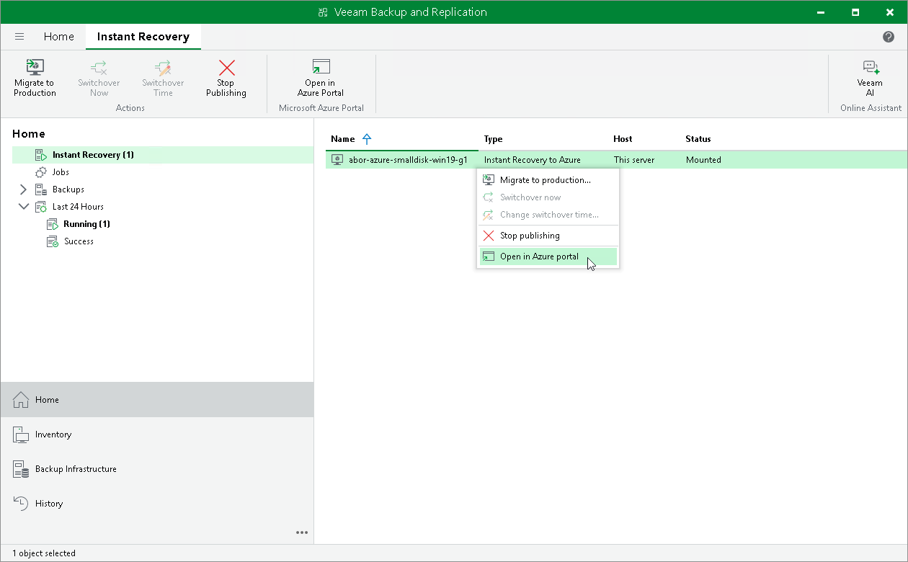
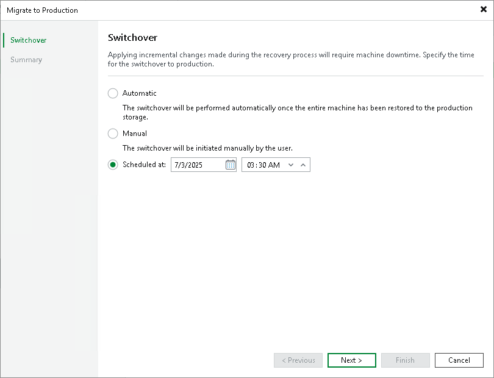
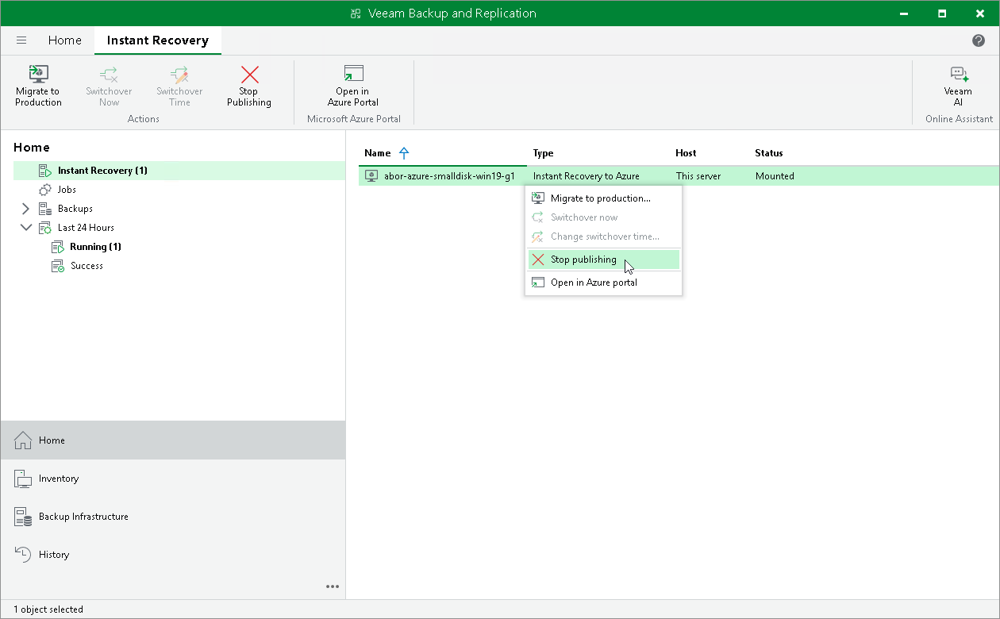

# Step 11. Finalizing Instant Recovery to Microsoft Azure

In this article

After the workloads have been successfully recovered, you must finalize the process. For this, test the workloads recovered as Microsoft Azure VMs and decide whether to migrate them to the production environment or stop publishing.

Testing Recovered VMs

To test the recovered VMs before you migrate them to production, you can launch the Microsoft Azure portal from Veeam Backup & Replication and there open the VM console.

To launch the Microsoft Azure portal from Veeam Backup & Replication:

1. Open the Home view.
2. In the inventory pane, select the Instant Recovery node.
3. In the working area, right-click a VM and select Open in Azure portal.

If the test fails, you can stop publishing the recovered VMs. For details, see [Stop Publishing Recovered VMs](#remove).

Migrating Recovered VMs

When Veeam Backup & Replication migrates VMs, it creates managed disks in Microsoft Azure, transfers disks data to them and then attaches the disks to the recovered VMs.

Veeam Backup & Replication performs migration in two phases:

* First phase: Veeam Backup & Replication sends commands to create disks for the recovered VM and transfer to these disks data from the backup. This phase may take significant time, especially if the VM is large. While Veeam Backup & Replication performs the first phase of the migration, the recovered VM is still up and running, users can access this VM and perform daily routine tasks as normal.
* Second phase (switchover): During this phase, Veeam Backup & Replication synchronizes the disk state and transfers the changes made since the recovered VM was turned on during the restore. Veeam Backup & Replication then sends commands to turn off the recovered VM. After the VM is turned off, Veeam Backup & Replication transfers the latest changes made since the previous synchronization. After all synchronizations are complete, Veeam Backup & Replication turns on the VM and deletes auxiliary resources created during recovery, such as the helper appliance and the storage account. This phase takes several minutes.

The second phase starts based on when you schedule the switchover in the Migrate to Production wizard. You can start the second phase automatically, at a scheduled time, or manually. If you choose to switch automatically, the second phase starts immediately after the first phase finishes. If you choose to switch at a scheduled time or manually, the second phase starts at the time you specify.

To migrate a recovered VM to production:

1. Open the Home view.
2. In the inventory pane, select the Instant Recovery node.
3. In the working area, right-click a VM and select Migrate to production.
4. In the Migrate to Production wizard, at the Switchover step, specify when the second phase of migration (switchover) must start:

* Select Auto if you want Veeam Backup & Replication to perform the switchover automatically right after the first phase of the migration finishes.
* Select Scheduled if you want Veeam Backup & Replication to perform the switchover at a specific time.
* Select Manual if you want to perform the switchover manually.

If you select the Scheduled or Manual option, you can further set the scheduled time or switch to the production VM manually. For more information, see [Changing Switchover Time](ir_azure_change_switching_time.md) and [Starting Switchover Manually](ir_azure_switch_to_prod.md).

1. At the Summary step, ensure that the switchover time is correct.

Stop Publishing Recovered VMs

If you have ensured that the recovered VM is working and you do not need it anymore, or your tests have failed, you can stop publishing the recovered VMs. This will remove the recovered VMs and resources newly created during recovery, except for resource groups. Note that all changes made in the recovered VMs will be lost.

To remove a recovered VM:

1. Open the Home view.
2. In the inventory pane, select the Instant Recovery node.
3. In the working area, right-click a VM and select Stop publishing.

Page updated 11/19/2025

Page content applies to build 13.0.1.1071
