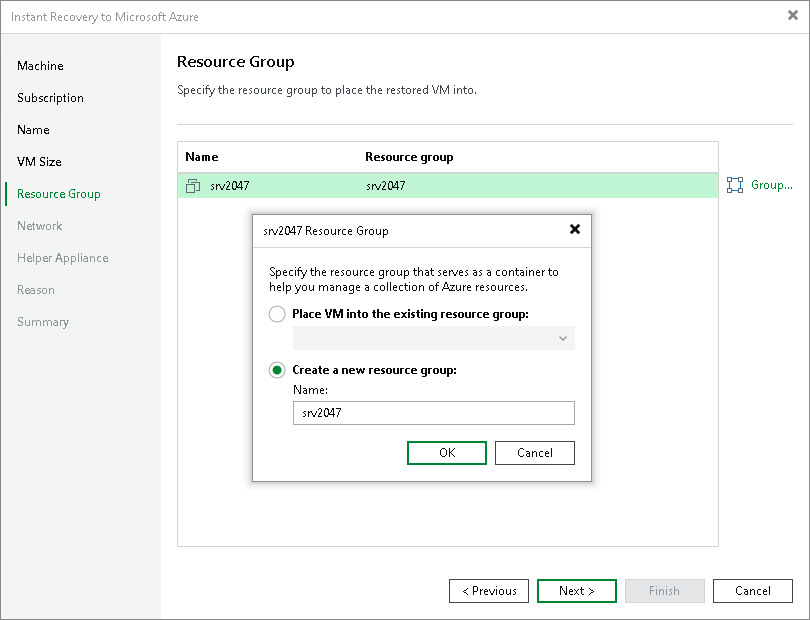

# Step 6. Specify Resource Group

At the Resource Group step of the wizard, you can select resource groups for the recovered VMs. By default, Veeam Backup & Replication creates a new resource group for the recovered VMs and places them in it.

To change a resource group to which a workload will be recovered:

1. In the list, select a workload and click Group.
2. In the Resource Group window, select the necessary option for the recovered VM:

* Select Place VM into the existing resource group if you want to place the recovered VM to an existing resource group. Then from the drop-down list, select the necessary resource group.
* Select Create a new resource group if you want to create a dedicated resource group for the recovered VM. In the Name field, enter a name for the new resource group.

In the new resource group, Veeam Backup & Replication automatically creates a network security group, a dynamic public IP and network interface.

|  |
| --- |
| Note |
| Microsoft Azure subscriptions have default limits on the number of resource groups. If you decide to create a new resource group, make sure that you do not exceed limits of the subscription. |

