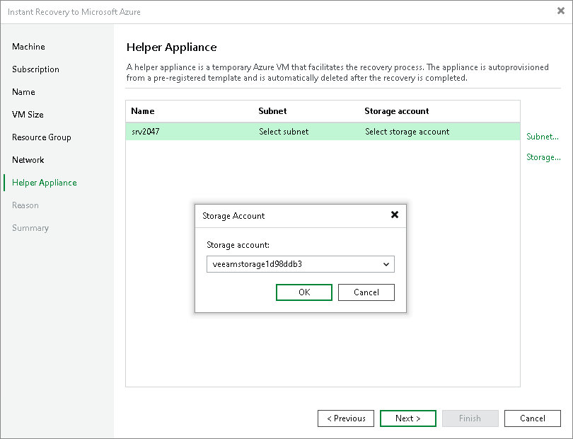

# Step 8. Configure Helper Appliance

During recovery, Veeam Backup & Replication creates a helper appliance for each workload. The size of each created VM is Standard\_D4lds\_v5. If you do not have enough available CPUs of that family, you can [change the helper appliance size](ha_template_change_size.md). The usage of helper appliances facilitates the recovery process. After the recovery finishes, Veeam Backup & Replication deletes the helper appliances.

At the Helper Appliance step of the wizard, configure helper appliance settings:

1. In the list, select a workload for which you want to configure a helper appliance.
2. Click Subnet to specify a subnet in which the helper appliance for the selected workload will be deployed.
3. Click Storage to specify a storage account through which the recovered VM will communicate with the helper appliance.

