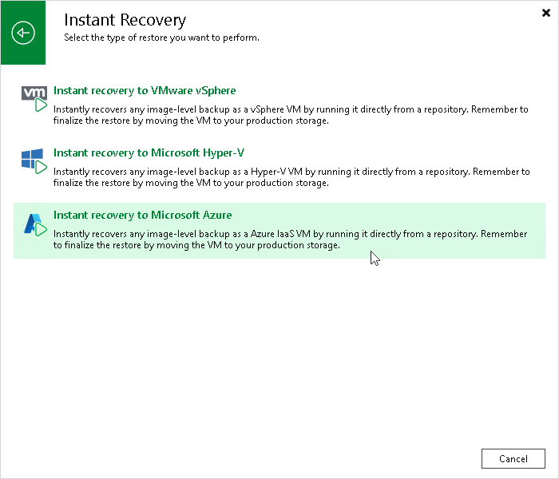

# Step 1. Launch Instant Recovery to Microsoft Azure Wizard

To launch the Instant Recovery to Microsoft Azure wizard, do one of the following:

* On the Home tab, click Restore and select one of the following:

* VMware vSphere > Restore from backup > Entire VM restore > Instant recovery > Instant recovery to Microsoft Azure — if you want to recover VMware vSphere VMs from a VM backup created by Veeam Backup & Replication or you want to recover VMware vSphere VMs from storage snapshots.
* VMware Cloud Director > Restore from backup > VM restore > Entire VM restore > Instant recovery > Instant recovery to Microsoft Azure — if you want to recover VMware Cloud Director VMs from a VM backup created by Veeam Backup & Replication.
* Microsoft Hyper-V > Restore from backup > Entire VM restore > Instant recovery > Instant recovery to Microsoft Azure — if you want to recover Hyper-V VMs from a VM backup created by Veeam Backup & Replication.
* Agent > Entire machine restore > Instant recovery > Instant recovery to Microsoft Azure — if you want to recover physical machines from a backup created by Veeam Agent for Microsoft Windows or Veeam Agent for Linux.

* oVirt KVM > Entire machine restore > Instant recovery > Instant recovery to Microsoft Azure — if you want to recover VMs from backups created by Veeam Backup for OLVM and RHV.

* AWS > Entire machine restore > Instant recovery > Instant recovery to Microsoft Azure — if you want to recover EC2 instances from a backup created by Veeam Backup for AWS.

* Proxmox VE > Entire machine restore > Instant recovery > Instant recovery to Microsoft Azure — if you want to recover VMs from backups created by Veeam Plug-In for Proxmox VE.

* Azure IaaS backup > Entire machine restore > Instant recovery > Instant recovery to Microsoft Azure — if you want to recover Azure VMs from a backup created by Veeam Backup for Microsoft Azure.

* Nutanix backup > Entire machine restore > Instant recovery > Instant recovery to Microsoft Azure — if you want to recover VMs from backups created by Veeam Plug-In for Nutanix AHV.

* GCE backup > Entire machine restore > Instant recovery > Instant recovery to Microsoft Azure — if you want to recover VM instances from a backup created by Veeam Backup for Google Cloud.

* Open the Home view. In the inventory pane, select Backups. In the working area, expand the necessary backup, select workloads that you want to recover and click Instant Recovery > Microsoft Azure on the ribbon. Alternatively, you can right-click one of the selected workloads and select Instant recovery > Microsoft Azure.

