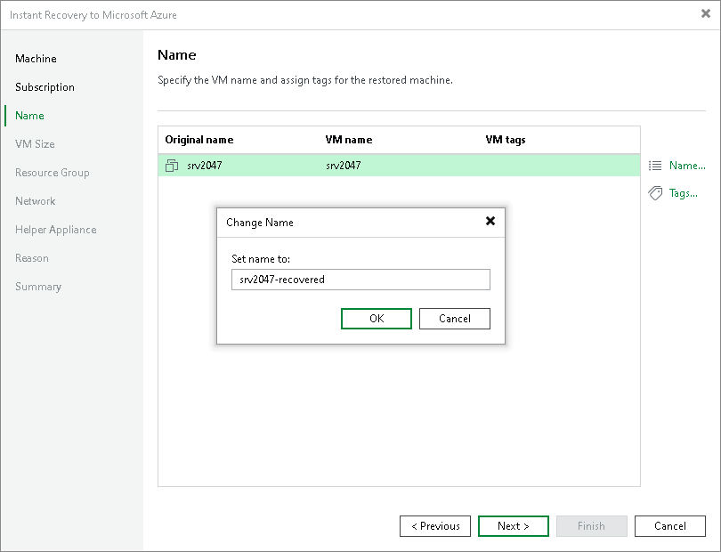
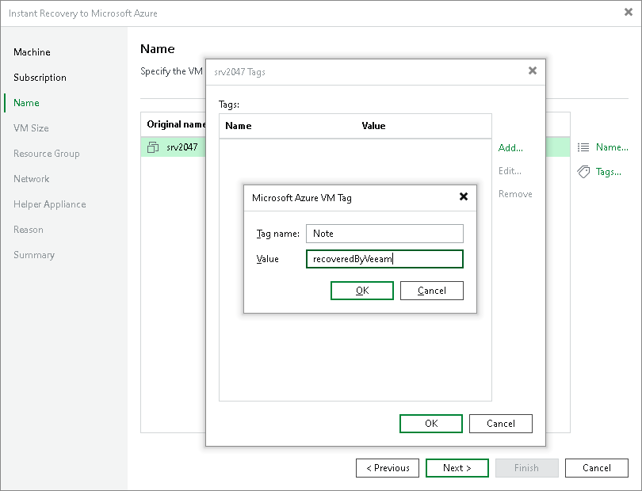

# Step 4. Specify Names and Tags

In this article

At the Name step of the wizard, you can specify names for the recovered VMs and assign tags to them. By default, Veeam Backup & Replication recovers workloads with their original names.

Specifying Names

To define a name for a VM:

1. In the list, select a workload and click Name.
2. In the Change Name window, enter a name for the recovered VM.

Adding Tags

To add a tag for the recovered workloads:

1. In the list, select a workload and click Tags.
2. In the Tags window, click Add.
3. In the Microsoft Azure VM Tag window, specify the tag name and its value.

Page updated 8/13/2025

Page content applies to build 13.0.1.1071
