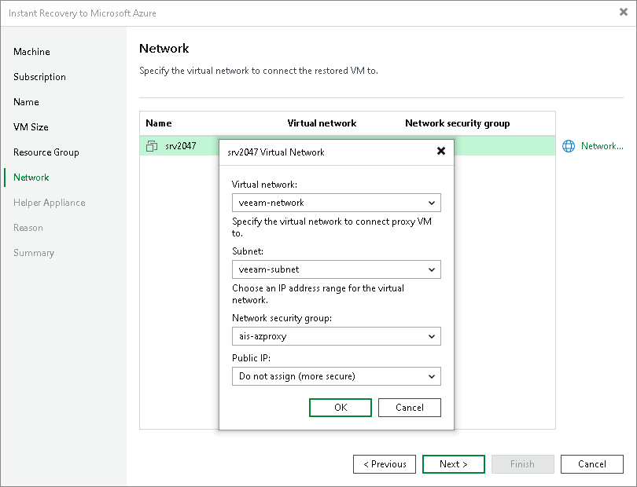

# Step 7. Configure Network Settings

In this article

At the Network step of the wizard, select the networks and subnets to which the recovered VMs will be connected. By default, Veeam Backup & Replication creates a new security group for the recovered VMs. The default security group rules are listed in [Default Security Group Rules](#rules).

To define network settings for a recovered VM, do the following:

1. In the list, select a workload and click Network.
2. From the Virtual network drop-down list, select a network to which the recovered VM must be connected.
3. From the Subnet drop-down list, select a subnet for the VM.
4. From the Network security group drop-down list, select the network security group.

If you leave the Empty value, Veeam Backup & Replication will create a new network security group. The rules for this group are described in [Default Security Group Rules](#rules).

1. In the Public IP field, specify whether to assign a public IP to the recovered VM. You have two options:

* Assign (restored VM will be accessible from the Internet). The public IP will be assigned to the recovered VM. For security reasons, make sure traffic filtration rules are properly configured in the security group.
* Do not assign (more secure). The public IP will not be assigned. You can assign a public IP later in the settings of the recovered VM.

|  |
| --- |
| Note |
| Veeam Backup & Replication can connect a recovered VM only to one virtual network. If necessary, you can manually configure additional network connections in Microsoft Azure after the workload is recovered. |

Default Security Group Rules

When you leave the Empty value while configuring the security group, Veeam Backup & Replication creates a security group with the following rules.

| Priority | Name | Port | Protocol | Source | Destination | Action |
| --- | --- | --- | --- | --- | --- | --- |
| Inbound security rules | | | | | | |
| 300 | SSH  Note: This rule applies if you recover Linux VMs. | 22 | TCP | Any | Any | Allow |
| 300 | RemoteDesktop  Note: This rule applies if you recover Microsoft Windows VMs. | 3389 | TCP | Any | Any | Allow |
| 65000 | AllowVnetInBound | Any | Any | VirtualNetwork | VirtualNetwork | Allow |
| 65001 | AllowAzureLoadBalancerInBound | Any | Any | AzureLoadBalancer | Any | Allow |
| 65500 | DenyAllInBound | Any | Any | Any | Any | Deny |
| Outbound security rules | | | | | | |
| 65000 | AllowVnetOutBound | Any | Any | VirtualNetwork | VirtualNetwork | Allow |
| 65001 | AllowInternetOutBound | Any | Any | Any | Internet | Allow |
| 65500 | DenyAllOutBound | Any | Any | Any | Any | Deny |

Page updated 11/19/2025

Page content applies to build 13.0.1.1071
