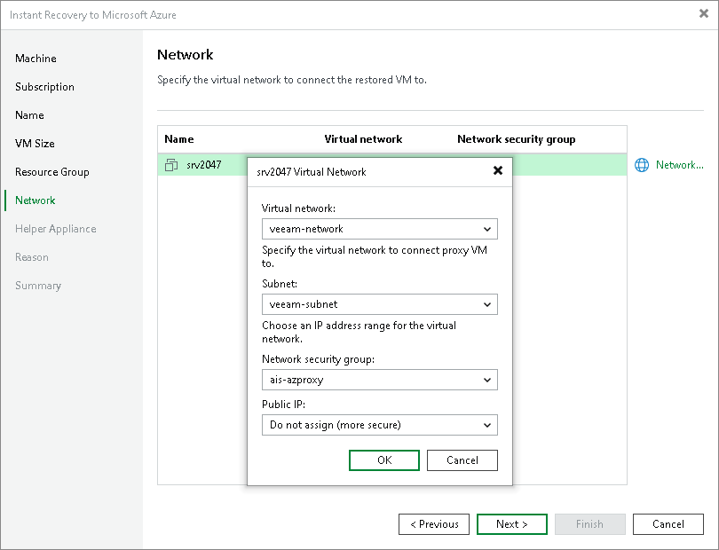
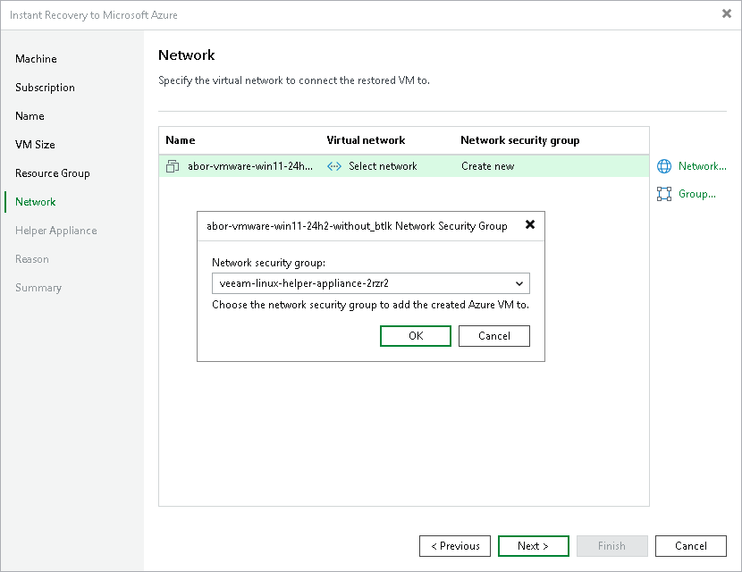

# Step 7. Configure Network Settings

At the Network step of the wizard, select the networks and subnets to which the recovered VMs will be connected. By default, Veeam Backup & Replication creates a new security group for the recovered VMs. The default security group rules are listed in [Default Security Group Rules](#rules).

Configuring Network

To define network settings for a workload:

1. In the list, select a workload and click Network.
2. From the Virtual network drop-down list, select a network to which the recovered VM must be connected.
3. From the Subnet drop-down list, select a subnet for the VM.
4. In the Public IP field, specify whether to assign a public IP to the recovered VM. You have two options:

* Assign (restored VM will be accessible from the Internet). The public IP will be assigned to the recovered VM. For security reasons, make sure traffic filtration rules are properly configured in the security group.
* Do not assign (more secure). The public IP will not be assigned. You can assign a public IP later in the settings of the recovered VM.

|  |
| --- |
| Note |
| Veeam Backup & Replication can connect a workload only to one virtual network. If necessary, you can manually configure additional network connections in Microsoft Azure after the workload is recovered. |

Configuring Security Group

To change a security group to which a workload will be recovered:

1. From the Virtual network list, select a workload and click Group.
2. From the Network security group drop-down list, how Veeam Backup & Replication assigns a network security group:

   1. Create new. Veeam Backup & Replication creates a new network security group. The rules for this group are described in [Default Security Group Rules](#rules).
   2. Do not assign (use subnet settings). Veeam Backup & Replication uses the network security group already associated with the target subnet.
   1. <existing group>. Veeam Backup & Replication assigns the selected network security group.

Default Security Group Rules

When you select the Create new option while configuring the security group, Veeam Backup & Replication creates a security group with the following rules.

Default Security Group Rules

| Priority | Name | Port | Protocol | Source | Destination | Action |
| Inbound security rules | | | | | | |
| 300 | SSH  Note: This rule applies if you recover Linux VMs. | 22 | TCP | Any | Any | Allow |
| 300 | RemoteDesktop  Note: This rule applies if you recover Microsoft Windows VMs. | 3389 | TCP | Any | Any | Allow |
| 65000 | AllowVnetInBound | Any | Any | VirtualNetwork | VirtualNetwork | Allow |
| 65001 | AllowAzureLoadBalancerInBound | Any | Any | AzureLoadBalancer | Any | Allow |
| 65500 | DenyAllInBound | Any | Any | Any | Any | Deny |
| Outbound security rules | | | | | | |
| 65000 | AllowVnetOutBound | Any | Any | VirtualNetwork | VirtualNetwork | Allow |
| 65001 | AllowInternetOutBound | Any | Any | Any | Internet | Allow |
| 65500 | DenyAllOutBound | Any | Any | Any | Any | Deny |

Page updated 2026-07-02

