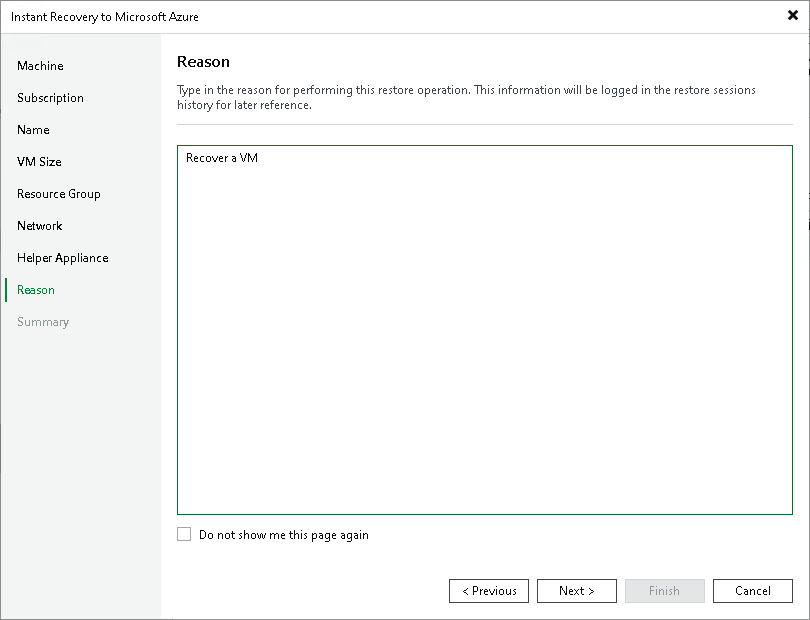

# Step 9. Specify Restore Reason

In this article

At the Reason step of the wizard, enter a reason for recovering the workloads. The information you provide will be saved in the session history in Veeam Backup & Replication, and you can view it later.

|  |
| --- |
| Tip |
| If you do not want to show this page, select the Do not show me this page again check box. If you want to unhide this page, follow the instructions described in [this Veeam KB article](https://www.veeam.com/kb4432). |

Page updated 6/30/2025

Page content applies to build 13.0.1.1071
