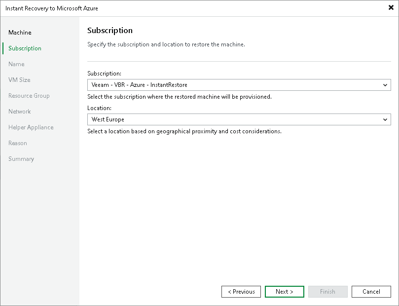

# Step 3. Select Subscription and Location

At the Subscription step of the wizard, select a subscription and location for the recovered VMs:

1. From the Subscription list, select a subscription whose resources you want to use. The list displays all subscriptions associated with the Azure compute account added to Veeam Backup & Replication.
2. From the Locations list, select a geographic region to which you want to place the recovered VMs. Make sure that you select a geographic region with which at least one storage account of the subscriptions is associated.

|  |
| --- |
| Important |
| You must have a preconfigured appliance template deployed in the location to which you recover workloads. If the template is not configured, Veeam Backup & Replication will display the [Template Settings](ha_template_add.md) window where you can configure the template in the selected location. After, Veeam Backup & Replication opens the window with all the configured appliance templates. You can also configure templates for other locations. Click Next to deploy the templates. |

