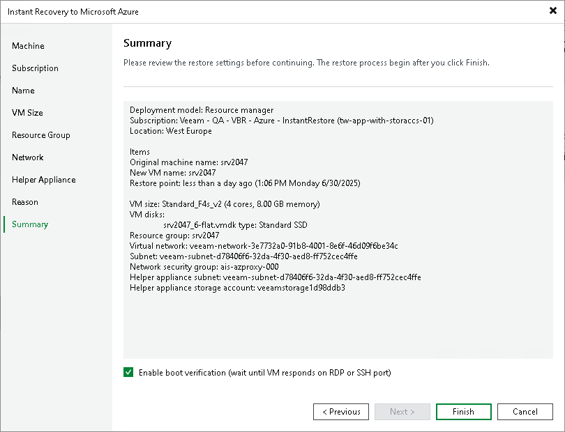

# Step 10. Verify Recovery Settings

At the Summary step of the wizard, check the specified settings and click Finish. If you want to check that the recovered VM boots successfully, select the Enable boot verification check box. Veeam Backup & Replication considers recovery as successful after receiving a response from the recovered VMs. If the response is not received, Veeam Backup & Replication sends a warning in the recovery session.

|  |
| --- |
| Tip |
| After recovery is started, Veeam Backup & Replication opens a recovery session. You can close it, restore will continue. To see session results, go to the Last 24 Hours node in the inventory pane. There, you can see multiple sessions related to Instant Recovery to Microsoft Azure. |

What You Do Next

[Finalizing Instant Recovery to Microsoft Azure](ir_azure_finalize.md)

