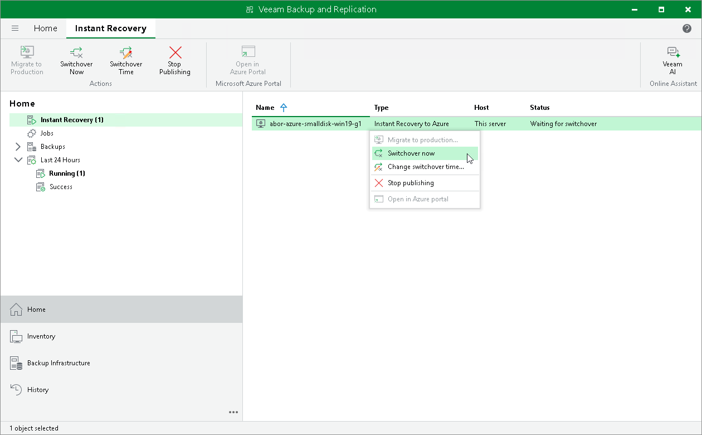

# Starting Switchover Manually

In this article

The following instructions apply if you have selected to start the switchover manually in the [Migrate to production](ir_azure_finalize.md#migrate) wizard.

To start the switchover, do the following:

1. Open the Home view.
2. In the inventory pane, navigate to the Instant Recovery node.
3. Right-click the VM for which you want to start the switchover and select Switchover to production.

Page updated 7/3/2025

Page content applies to build 13.0.1.1071
