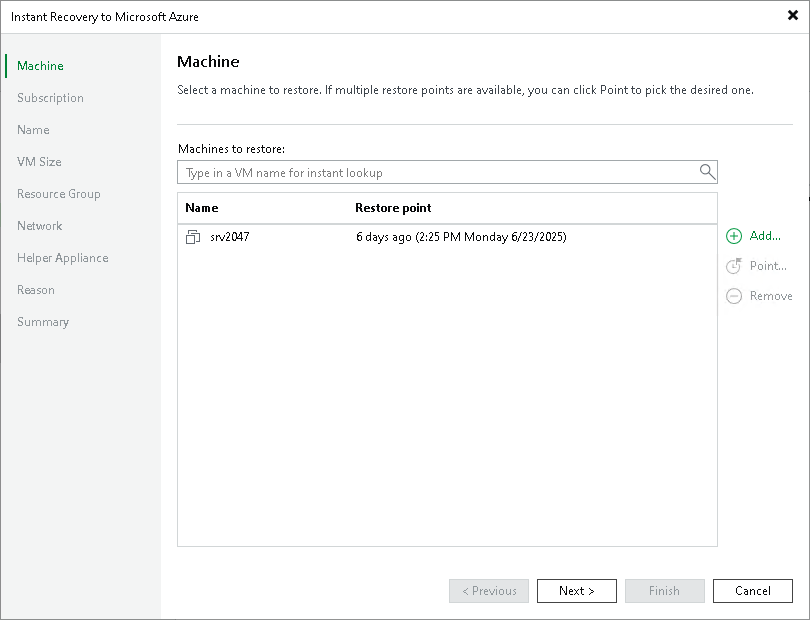
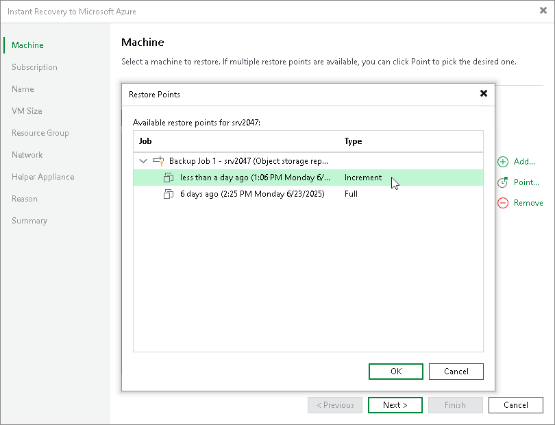

# Step 2. Select Workloads and Restore Points

At the Machine step of the wizard, specify the workloads you want to recover and specify the restore points to which you want to recover the workloads. By default, Veeam Backup & Replication recovers workloads to the latest valid restore point in the backup chain.

Selecting Workloads

To select workloads to recover:

1. On the right of the Machine list, click Add.
2. In the Backup Browser window, expand the necessary backup, select workloads and click Add.

Selecting Restore Points

To select a restore point for a workload, do the following:

1. In the Machine list, select a workload.
2. Click Point on the right.
3. In the Restore Points window, select a restore point to which you want to recover the workload.

