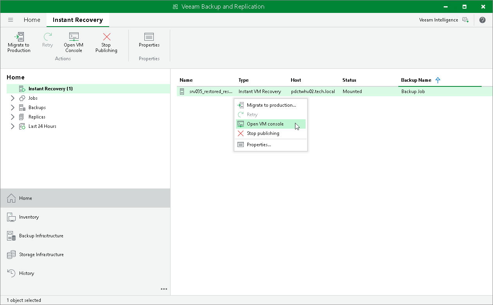
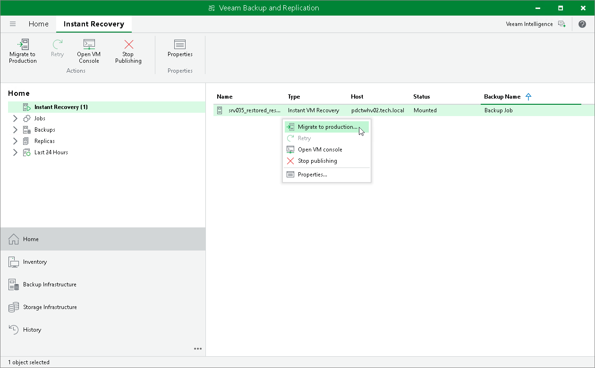
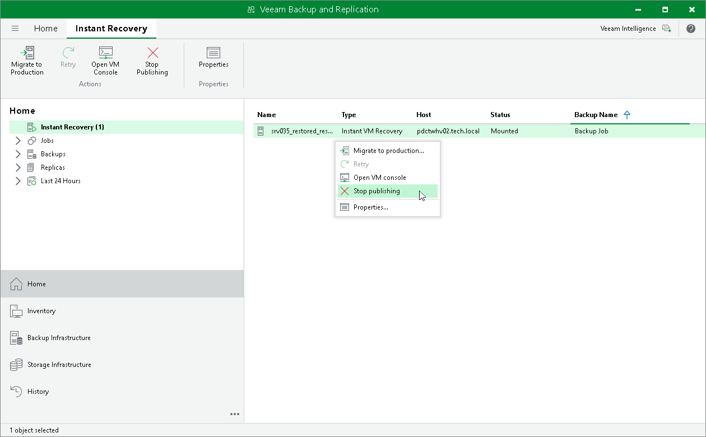

# Step 13. Finalizing Instant Recovery to Microsoft Hyper-V

After the VMs have been successfully recovered, you must finalize the process. For this, test the recovered VMs and decide whether to migrate them to production environment or stop publishing.

Testing Recovered VMs

To test the recovered VMs before you migrate them to production, you can launch VM consoles from Veeam Backup & Replication or open the consoles in the Hyper-V client.

To launch a VM console from Veeam Backup & Replication:

1. Open the Home view.
2. In the inventory pane, select the Instant Recovery node.
3. In the working area, right-click a VM and select Open VM console.

If the test fails, you can stop publishing the recovered VMs. For details, see [Stop Publishing Recovered VMs](#remove).

Migrating Recovered VMs

When Veeam Backup & Replication migrates VMs, it transfers VM disks data to the production storage that you have selected as a destination for the recovered VMs.

|  |
| --- |
| Note |
| [If you recover Hyper-V VMs] After the migration is finished, and if the selected destination differs from the original location, the original VMs still exist. If you do not need them, you must manually remove them in the Hyper-V client. |

To migrate a recovered VM to production:

1. Open the Home view.
2. In the inventory pane, select the Instant Recovery node.
3. In the working area, right-click a VM and select Migrate to production.

Stop Publishing Recovered VMs

If you have ensured that the VM is working and you do not need it anymore, or your tests have failed, you can stop publishing the recovered VMs. This will remove the recovered VMs from the storage that you selected as the destination for recovery. Note that all changes made in the recovered VMs will be lost.

|  |
| --- |
| Important |
| [For Hyper-V VM restore to original location] Both the recovered and original VMs are removed if you stop publishing the recovered VM. This is because during restore to the original location, Veeam Backup & Replication removes the original VM. |

To remove a recovered VM:

1. Open the Home view.
2. In the inventory pane, select the Instant Recovery node.
3. In the working area, right-click a VM and select Stop publishing.

