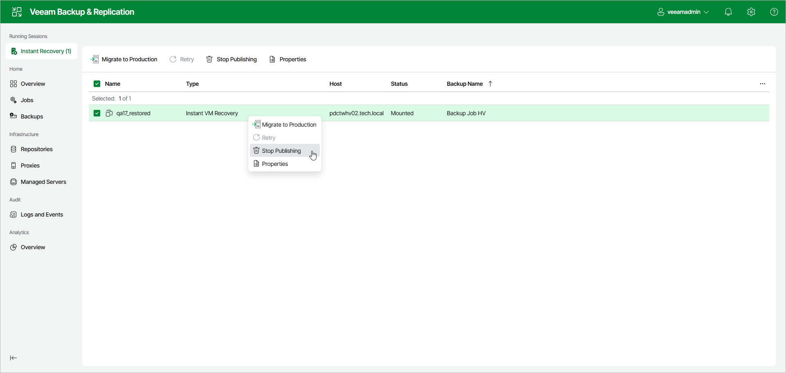

# Step 10. Finalizing Instant Recovery to Microsoft Hyper-V

After the VMs have been successfully recovered, you must finalize the process. For this, test the recovered workloads in the Hyper-V client and decide whether to migrate them to production environment or stop publishing.

Migrating Recovered VMs

When Veeam Backup & Replication migrates VMs, it transfers workload disks data to the production storage that you have selected as a destination for the recovered workloads.

To migrate a recovered VM, click Instant Recovery in the management pane. Select the VM and click Migrate to Production. Alternatively, right-click the VM and select Migrate to Production.

|  |
| --- |
| Note |
| [If you recover Hyper-V VMs] After the migration is finished, and if the selected destination differs from the original location, the original VMs still exist. If you do not need them, you must manually remove them in the Hyper-V client. |

Stop Publishing Recovered VMs

If you have ensured that the recovered VM is working and you do not need it anymore, or your tests have failed, you can stop publishing the recovered VM. This will remove the recovered workloads from the storage that you selected as the destination for recovery. Note that all changes made in the recovered VMs will be lost.

To stop publishing a VM, click Instant Recovery in the management pane. Select the workload and click Stop Publishing. Alternatively, right-click the workload and select Stop Publishing.

|  |
| --- |
| Important |
| [For Hyper-V VM restore to original location] Both the recovered and original VMs are removed if you stop publishing the recovered VM. This is because during restore to the original location, Veeam Backup & Replication removes the original VM. |

