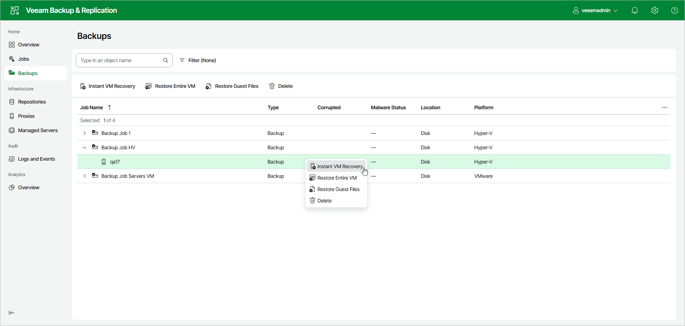

# Step 1. Launch Instant Recovery Wizard

In this article

To launch Instant Recovery using the web UI, do the following:

1. Select Backups in the management pane.
2. In the working area, select workloads whose files you want to recover.
3. Click Instant VM Recovery. Alternatively, right-click one of the selected workloads and click Instant VM Recovery.

Page updated 8/29/2025

Page content applies to build 13.0.1.1071
