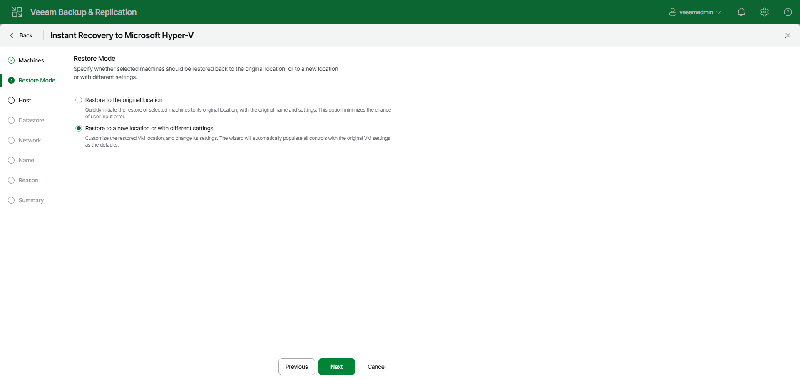

# Step 3. Select Restore Mode

At the Restore Mode step of the wizard, choose the necessary restore mode:

* Select Restore to the original location if you want to recover workloads with their initial settings to the original location. If this option is selected, you will pass directly to the [Reason](ir_reason_hv_web.md) step of the wizard.
* Select Restore to a new location or with different settings if you want to recover workloads to a different location and with different settings (such as location, network settings, and so on). If you select this option, the Instant Recovery to Hyper-V wizard will include additional steps for customizing settings.

|  |
| --- |
| Important |
| If you recover a workload to the original location, consider the following:   * If the original workload still exists in the virtual infrastructure, the workload and its disks will be removed. Make sure that other workloads in the virtual environment do not use these disks. * The settings contain the ID of the VM group to which the workload belongs. To recover the workload to the original group, you must not delete the original group or change the hierarchy of its parent groups. |

