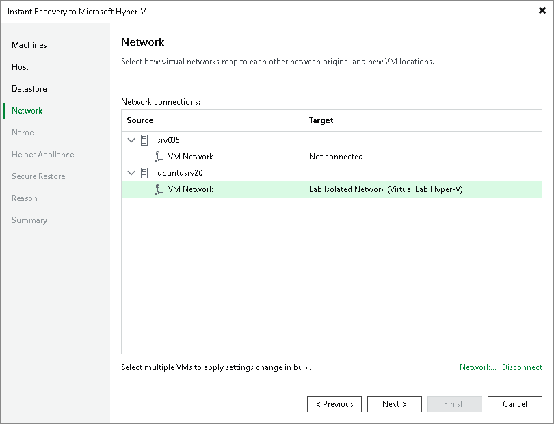

# Step 7. Configure Network Mapping

In this article

This step is available if you recover workloads to a new location or with different settings.

At the Network step of the wizard, configure a network mapping table. This table maps networks in the original site to networks in the target site (site where VMs will be recovered). When the job starts, Veeam Backup & Replication will check the network mapping table. Then Veeam Backup & Replication will update VM configuration files to replace the original networks with the specified networks in the target site. As a result, you will not have to re-configure network settings manually.

To specify network mapping settings:

1. In the Network connections list, select the necessary workloads and click Network.

If a workload is connected to multiple networks, expand the workload, select a network to map and click Network.

1. In the Select Network window, select a network to which the selected workload must be connected after recovery.

If you do not want to connect the recovered VM to any virtual network, select the original workload in the list and click Disconnect.

Page updated 8/8/2025

Page content applies to build 13.0.1.1071
